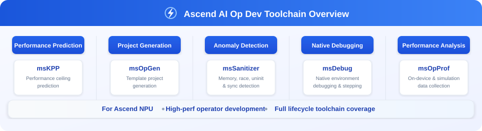

<h1 align="center">MindStudio Operator Tools</h1>

<b>Ascend AI Operator Development Toolchain</b>

 
  
  
  
  
  

English | [简体中文](./README.md)

## ✨ What's New

🔹 **[2025.12.31]**: MindStudio Operator Tools fully open-sourced

## ℹ️ Overview

MindStudio Operator Tools (msOT) is an operator development toolchain that focuses on key challenges in operator development. By providing capabilities such as operator design, development framework generation, functional debugging, anomaly detection, and multi-dimensional performance tuning, it reduces the complexity of operator development and improves the delivery efficiency of high-performance operators.

## ⚙️ Feature Overview

The operator development toolchain provides the following series of tools:

| Category | Tool Name | Feature Overview                                                      |
|:--:| :--- |:----------------------------------------------------------|
| Design | [**msKPP**](https://gitcode.com/Ascend/mskpp) | **[Performance Prediction]** Supports inputting operator descriptions to predict the performance upper limit of an operator under a specific algorithm implementation.                    |
| Build | [**msOpGen**](https://gitcode.com/Ascend/msopgen) | **[Project Generation]** An operator development efficiency improvement tool that provides template project generation capabilities, simplifying project setup.                  |
| Verification | [**msKL**](https://gitcode.com/Ascend/mskl) | **[Quick Invocation]** Provides a Python interface to quickly launch and run Kernels, facilitating rapid functional verification.         |
| Detection | [**msSanitizer**](https://gitcode.com/Ascend/mssanitizer) | **[Anomaly Detection]** Provides memory, race condition, uninitialized access, and synchronization detection, supporting precise localization of memory issues in multi-core programs.             |
| Debugging | [**msDebug**](https://gitcode.com/Ascend/msdebug) | **[Native Debugging]** Native environment debugging based on Ascend processors, supporting variable inspection, single-step execution, and on-device debugging.               |
| Tuning | [**msOpProf**](https://gitcode.com/Ascend/msopprof) | **[Performance Analysis]** Supports on-device and simulation data collection, and locates performance bottlenecks through the MindStudio Insight visualization tool. |

## 🚀 Quick Start

Taking a simple addition operator as an example, this guide covers the entire operator development process. See [Operator Development Toolchain Quick Start](docs/en/quick_start/op_tool_quick_start.md).

## 📦 Installation Guide

For an introduction to the environment dependencies and installation methods of msOT tools, see the [msOT Installation Guide](./docs/en/install_guide/msot_install_guide.md).

## 📘 User Guide

Use the links in the feature overview table to access the corresponding source code repositories and see the User Guide in their README files. To select a tool based on your scenario, see the [msOT Tool Selection Guide](./docs/en/user_guide/msot_user_guide.md).

## 🌌 Intelligent Search

To improve documentation retrieval efficiency, we provide multiple search methods:  
🔹 [Precise Search (ReadTheDocs)](https://mindstudio-operator-tools-docs.readthedocs.io/zh-cn/latest): Search the full text by keyword and go directly to information such as APIs, parameters, and error messages.  
🔹 [AI Q&A (DeepWiki)](https://deepwiki.com/mindstudio-docs/26.1.0): Ask questions in natural language to quickly understand the project architecture and relationships between modules.   
🔹 [AI Q&A (ZRead)](https://zread.ai/mindstudio-docs/26.1.0): Provides a better Chinese Q&A experience and accurately locates feature usage and details.   

## 🛠️ Contribution Guide

Welcome to participate in project contributions. Please refer to the [Contribution Guide](./docs/en/contributing/contributing_guide.md).

## ⚖️ Related Notes

🔹 [Release Notes](./docs/en/release_notes/release_notes.md)   
🔹 [License Notice](./docs/en/legal/license_notice.md)    
🔹 [Security Statement](./docs/en/legal/security_statement.md)     
🔹 [Disclaimer](./docs/en/legal/disclaimer.md)     

## 🤝 Suggestions and Communication

Everyone is welcome to contribute to the community. If you have any questions or suggestions, please submit an [Issue](https://gitcode.com/Ascend/msot/issues), and we will respond as soon as possible. Thank you for your support.

|                                                                            Real-Time Interaction (WeChat Group)                                                                             |                                                                                  Official Information (Official Account)                                                                                   | In-Depth Support (Assistant/Forum)                                                                                                                                                                                                                                                                                                                                                                                                                                                                                                 |
|:------------------------------------------------------------------------------------------------------------------------------------------------------------------:|:------------------------------------------------------------------------------------------------------------------------------------------------------------------------------:|:----------------------------------------------------------------------------------------------------------------------------------------------------------------------------------------------------------------------------------------------------------------------------------------------------------------------------------------------------------------------------------------------------------------------------------------------:|
|  *Scan the QR code to join the technical discussion group* |  *Scan the QR code to follow the official account* | Scan the QR code to join the group and follow the official account for the fastest way to connect with MindStudio users and developers:  **Ask questions quickly:** Discuss technical issues with community members in real time. **Stay up to date:** Receive notifications about version releases and feature updates as soon as they are available.  **Share experience:** Exchange best practices and hands-on experience with developers.      **More support channels**: 👉 Ascend Assistant:  👉 Ascend Forum:  |

## 🙏 Acknowledgments

msOT is jointly contributed by the following departments of Huawei:    
🔹 Ascend Computing MindStudio Development Department  
🔹 Ascend Computing Ecosystem Enablement Department  
🔹 Huawei Cloud AI Compute Service  
🔹 Compiler Technologies Lab, 2012 Labs  
🔹 Markov Lab, 2012 Labs  
Thank you for every PR from the community, and welcome to contribute to msOT.
