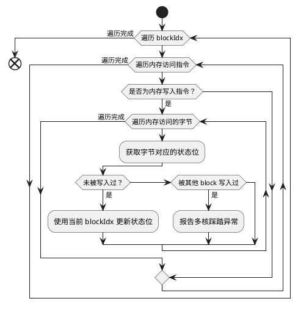
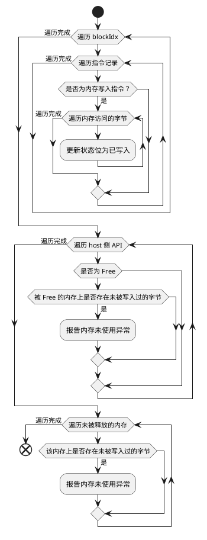

## 内存检测

内存检测当前可对以下内存异常进行检测：

| 异常类型   | 描述 | 内存事件发生的位置 |
| ---------- | ---- | ------------------ |
| 非法读写   | NA     | host,kernel        |
| 非对齐访问 | NA     | kernel             |
| 多核踩踏   | NA     | kernel             |
| 内存泄漏   | NA     | host               |
| 非法释放   | NA     | host               |
| 内存未使用 | NA     | host               |

### 非法读写

非法读写可以总结为内存访问事件超过了可访问的内存范围而导致的错误。

#### GM malloc 内存非法读写

**内存事件发生的位置：host、kernel    支持内存的类型：GM  是否精确：是**

通常我们说的GM可访问范围是通过 aclrtMalloc系列接口申请的所有内存范围，访问未分配过的内存是非法的。

算子程序的整个生命周期可以分为 host 和 kernel 两部分，GM 内存的分配和释放一定发生在 host 侧，但是内存访问既可以发生在 host 侧也可以发生在 kernel 侧。host 侧主要通过 `aclrtMemcpy`、`aclrtMemset` 等 API 进行内存访问，kernel 侧通过 SIMD、MTE、scalar 等指令进行内存访问，如果host/device对GM内存的访问超过申请的范围，则发生非法读写错误。

#### GM 共享内存非法读写

**内存事件发生的位置：host、kernel    支持内存的类型：GM  是否精确：是**

此场景可以认为是 Malloc 内存分配的一种扩展场景。默认情况下，算子只能访问当前卡上的 GM 内存。ACL 接口提供了卡间内存共享的能力，能让一张卡上的任务，通过映射来的 Device 内存地址指针访问另一张卡上的 GM 内存。工具会对共享内存的状态以及地址进行跟踪，如果 host/device 对 GM 内存的访问超过共享内存的范围，则发生非法读写错误。

#### 基于算子meta信息的非法读写

**内存事件发生的位置：kernel    支持内存的类型：GM   是否精确：是**

PyTorch+ACLNN场景下，框架会上报各个算子 tensor 地址和长度相关的 DFX 信息，去额外规范算子可访问的内存范围。当该范围在malloc申请的内存范围内时，工具会优先以该信息来进行非法读写检测，如果对应算子对内存的访问超出了框架上报的范围则认为发生非法读写错误。

#### 运行时隐式可访问空间的非法读写

**内存事件发生的位置：kernel    支持内存的类型：GM   是否精确：是**

运行时在下发算子时，会隐式的申请一些内存空间，工具会感知这些内存范围，并在算子 kernel 侧检测时标记为可访问范围。

##### Tiling

ACLNN、GE等框架在进行算子下发时，会由运行时来管理Tiling在GM内存上的空间申请和搬运，工具此时会从运行时提供的信息中获取Tiling所属的GM地址和长度，作为合法的访问空间。

##### **PlaceHolder**

使用aclrtKernelArgsAppendPlaceHolder接口添加的参数会由运行时进行GM内存的分配，工具中也会感知到这块地址，作为合法的访问空间。

##### Allocatable section

算子 kernel 二进制在执行前，运行时会将二进制中带有 Allocatable 属性的段连同算子二进制文件一起加载到 GM 指定位置，这些内存范围也可以被访问。最常见的就是用于保存全局变量和常量的 `.data` 和 `.rodata` 段。

##### Overflow buffer

AscendC 编程框架中内置了可选的 overflow 检查功能，该功能会在算子执行完成前，向运行时内部管理的一块 GM 内存写入一些结果数据。该块内存长度固定为512字节，也会被工具感知并作为合法空间。

##### Parameter vector

kernel下发时用于存放入参的GM地址也由运行时进行管理，kernel 内对这块地址的访问也是合法的。

#### AICore内存单元非法读写

**内存事件发生的位置：kernel    支持内存的类型：UB、L1、L0A、L0B、L0C、Stack   是否精确：是**

AICore上的UB、L1、L0A、L0B、L0C、Stack等内存在硬件角度没有申请释放的概念，因此软件的可访问范围是该内存的存储空间大小，只要不超过存储空间的上限，工具就认为是合法访问。

ps：需要注意不同的昇腾芯片的片上内存大小不同。

### 非对齐访问

检测内存访问是否满足指令的对齐规则要求。对齐规则跟指令类型和内存类型有关，具体规则可参考 AscendC 接口说明。

#### **Scalar 指令非对齐访问**

**内存事件发生的位置：kernel    支持内存的类型：UB、Stack、GM   是否精确：是**

此时访问的地址要求与访问的数据类型大小对齐。

#### **SIMD搬运/计算指令非对齐访问**

**内存事件发生的位置：kernel    支持内存的类型：UB、L1、L0A、L0B、L0C   是否精确：是**

此时访问的地址要求与对应内存的Block大小对齐。

### 内存踩踏

用户算子中，某些指令发生了对预期之外合法内存的写入，则工具认为发生内存踩踏。

#### 核间GM内存踩踏

**内存事件发生的位置：kernel    支持内存的类型：GM   是否精确：否**

多核踩踏是指多个 blockIdx 向相同的 GM 内存发生了写入。多核踩踏的检测规则如下：



根据多核踩踏的检测规则，如果工具在第 `i` 个 block 上报告了多核踩踏异常，说明该内存已经被序号为 `[0, i - 1]` 的 block 写入过。同时需要注意，多核踩踏检测时不会感知核间同步，需用户自行确认是否存在踩踏问题。

### 内存泄漏

昇腾程序在执行过程中，工具会监测内存的分配和释放。当程序退出时，如果存在未被释放的内存，工具会报错内存泄漏异常。

#### **GM内存泄漏检测**

**内存事件发生的位置：Host   支持内存的类型：GM   是否精确：是**

当用户程序使用aclrtMalloc系列接口申请了内存，但是没有使用aclrtFree接口释放时，则认为发生了GM内存泄漏问题

### 非法释放

非法释放是指释放了未被分配过、或已经被释放过的内存地址。

#### **GM内存非法释放**

**内存事件发生的位置：Host   支持内存的类型：GM   是否精确：是**

当用户程序使用aclrtFree接口释放了未使用aclrtMalloc系列接口申请的地址或已经被释放过的地址，则认为发生了GM内存非法释放问题

### 内存未使用

内存未使用是指被分配的内存，在被释放或程序退出时，存在没有被写入过的字节。可以表征用户分配了冗余的内存，或少写入了数据。内存未使用的检测规则如下：



#### **GM内存未使用检测**

**内存事件发生的位置：Host/Kernel   支持内存的类型：GM   是否精确：是**

在内存被释放时，工具会分析该内存是否经过了充分的使用，如果存在未被Host侧或Kernel侧写入过的片段，则认为发生了内存未使用

#### **基于算子meta信息的算子内存未使用检测**

**内存事件发生的位置：Host/Kernel   支持内存的类型：GM   是否精确：是**

PyTorch+ACLNN场景下，框架会上报各个算子 tensor 地址和长度相关的 DFX 信息，去额外规范算子可访问的内存范围。当算子执行完成后，如果识别到对应的内存范围中存在未被写入过的片段，则认为发生了内存未使用

## 竞争检测

竞争检测当前可对以下内存竞争进行检测：

| 异常类型   | 描述 | 内存事件发生的位置 |
| ---------- | ---- | ------------------ |
| 流水内竞争 | NA     | kernel             |
| 流水间竞争 | NA     | kernel             |
| 核间竞争   | NA     | kernel             |

### 流水内竞争

一般来说，指令执行都不是原子的，如 PIPE_V 上的 SIMD 计算指令可以分成 读入->计算->写出 三个过程。因此同一条流水上的两条指令如果访问了相同的内存空间，则可能存在流水内竞争风险。

说明：此处的竞争和硬件微架构相关，缺少同步未必一定会导致流水内指令的竞争

#### **pipe_barrier缺失导致的流水内竞争**

**内存事件发生的位置：Kernel   支持内存的类型：UB、L1、L0A、L0B、L0C、GM   是否精确：否**

一般来说，指令执行都不是原子的，如 PIPE_V 上的 SIMD 计算指令可以分成 读入->计算->写出 三个过程。因此同一条流水上的两条指令如果访问了相同的内存空间，则可能存在流水内竞争风险。

对于同一条流水上的任意两条指令，只要满足以下所有条件工具就会认为存在流水内竞争风险：

1. 两条指令之间没有当前流水上的 `pipe_barrier` 指令
2. 两条指令访问了重叠的内存区域，并且两条指令中至少有一条指令对该内存区域有写入操作

#### **使用多流水间同步语义避免流水内竞争的情况**

**内存事件发生的位置：Kernel   支持内存的类型：UB、L1、L0A、L0B、L0C、GM   是否精确：否**

一些指令或指令片段会隐含了 pipe_barrier 的语义，工具会等同于使用了pipe_barrier来处理。当前工具能够识别到的这类特殊指令和场景如下：

1. ffts_cross_core_sync 的 pipe 参数类似 barrier 中的 pipeline，表示同步点在哪个 pipeline 中，当该 pipeline 前面所有指令执行完毕后达到同步点, 	ffts_cross_core_sync 前后的指令不会发生流水内竞争
2. 两条指令间存在从当前流水到其他流水，再从其他流水回到当前流水的原状同步，此时两条不会发生流水内竞争

### 流水间竞争

AICore 中有多条流水，不同类型的指令在对应的流水上执行。当不同流水上的两条指令同时满足以下规则时，工具会认为存在竞争风险：

- 时间重叠：两条流水间的同步指令无法保证两条指令时序上的 happens-before 关系，那么两条指令在时序上不确定
- 空间重叠：两条指令访问了重叠的内存空间
- 访问方式：两条指令中至少有一条指令对该内存区域有写入操作

算子开发者可以通过合理设置 set_flag/wait_flag 指令来保证指令时序，从而避免竞争风险。

ps: 由于所有指令都是从 PIPE_S 上发射到对应流水上执行的，因此在 PIPE_S 上执行的指令不会与其之后的指令产生竞争。

#### AICore 内流水竞争

**内存事件发生的位置：Kernel   支持内存的类型：UB、L1、L0A、L0B、L0C、GM   是否精确：是**

针对同一个AICore内的两条流水，如果发生对同一块地址的读写、写写访问时缺少了同步指令，则认为发生了流水间竞争问题，当前支持以下同步指令的竞争检测：

- set_flag/wait_flag
- hset_flag/hwait_flag
- pipe_barrier(PIPE_ALL)

#### AICore 间流水竞争

**内存事件发生的位置：Kernel   支持内存的类型：GM   是否精确：是**

昇腾设备上多个 AICore 会并行执行，各 AICore 上的指令访问 GM 内存时就可能发生竞争。对于 910B 及以上的分核架构芯片，竞争可能发生在 AIVector 和 AICube 中任意两个核之间。

算子开发者可以通过合理设置核间同步指令来保证指令时序，从而避免竞争风险。当前支持以下同步指令的感知：

- 核间硬同步指令：ffts_cross_core_sync/wait_flag_dev
- 核间软同步指令：IBSet/IBWait/SyncAll

## 初始化检测

初始化检测旨在识别：访问未被初始化过的内存的读内存行为，以找出由于初始化顺序不当等引起的程序错误。初始化检测支持对以下异常类型进行检测：

| 异常类型         | 内存事件发生的位置 | 支持的内存类型空间            |
| ------------------ | -------------------- | ------------------------------- |
| 读取未初始化内存 | Host               | GM                            |
| 读取未初始化内存 | Kernel             | GM、UB、L1、L0A、L0B、L0C、栈 |

#### Host侧读取未初始化内存

**内存事件发生的位置：Host 支持内存的类型：GM 是否精确：是**

在Host通过`aclrtMalloc`系列接口申请GM内存后，其分配的GM地址范围被认为是可寻址但未初始化状态，当使用`aclrtMemcpy`、`aclrtMemset` 等 API 进行对这些未初始化状态的内存写操作后，内存状态会被更新为已初始化状态，若使用API对未初始化状态的GM内存进行读操作，则会被认为出现了读取未初始化内存异常。

#### Kernel侧读取未初始化内存

**内存事件发生的位置：Kernel 支持内存的类型：GM、UB、L1、L0A、L0B、L0C、Stack 是否精确：否**

当前工具支持基于Scalar下发顺序检测是否读取未初始化内存，因此如果出现不遵循Scalar下发序列的Kernel初始化+数据读取，可能会有误报

## 同步检测

同步检测用于检测算子 kernel 中对同步指令的错误使用。

### 核内流水同步指令配对检测

**内存事件发生的位置：kernel    支持内存的类型：NA  是否精确：是**

昇腾提供了配对的同步指令用于流水间的同步，指令原型如下：

```c++
void set_flag(pipe_t pipe, pipe_t tpipe, event_t eventID);
void wait_flag(pipe_t pipe, pipe_t tpipe, event_t eventID);
void hset_flag(pipe_t pipe, pipe_t tpipe, event_t eventID);
void hwait_flag(pipe_t pipe, pipe_t tpipe, event_t eventID);
```

其中 `pipe`、`tpipe`、`eventID` 三个参数决定了同步事件的属性，每个 `set` 指令必须要有相同属性的 `wait` 配对使用，反之亦然。

当前仅支持检测缺少 `wait_flag` 指令的情况。

### 核间同步指令配对检测（暂未实现）

**内存事件发生的位置：kernel    支持内存的类型：NA   是否精确：是
昇腾提供了配对的硬软同步指令用于核间的同步，指令原型如下：

```c++
void ffts_cross_core_sync
void wait_flag_dev
void IBSet
void IBWait
```

支持对上述指令的配对检测

### 同步指令入参有效性检测（暂未实现）

针对set_flag/wait_flag/hset_flag/hwait_flag/wait_flag_dev/ffts_cross_core_sync/IBSet/IBWait的入参有效性检测

### 无效同步指令检测（暂未实现）

连续两条相同的set_flag间，没有对应pipe的指令（目标pipe没有需要等待的指令）

### 同步指令非法使用检测（暂未实现）

ffts_cross_core_sync无wait情况下连续下发超过15次

## MSTX拓展接口支持

mstx接口是MindStudio提供的一套扩展接口，它允许用户在应用程序中插入特定的标记，以便在工具进行内存检测时能够更精确地定位特定算子的内存问题。例如，在Host通过使用mstx Host系列接口，可以将二级指针类算子使用的合法GM地址空间精确传递给异常检测工具，实现二级指针类算子更精准的内存检测。

### Host系列接口

#### 内存池分配信息上报

开发者可以使用mstx中的内存池管理相关接口，向msSanitizer报告内存池的分配情况。这种情况下工具会在检测过程中忽略掉对整个内存池的分配使用动作，而关注具体分配的每个子内存块。

## AscendC API 异常检测（暂未实现）


