# 异常检测软件实现设计说明书 8.2.0

## 概述

### 目的

昇腾芯片本身内部有多个核心，基于昇腾芯片的开发需要小心地处理各个核心负责的内存块，同时，片上内存有对齐的要求，容易产生内存踩踏、内存对齐、内存初始化、流水竞争等问题。本工具提供内存检测、竞争检测等检测功能，帮助用户快速识别并定位此类问题。

本文的目的是对异常检测功能进行设计，明确主要数据结构和主要处理过程，作为今后的编码阶段的输入和编码人员、测试人员的指导。

### 范围

1. 支持 AscendC 单算子场景的内存检测，包含非法访问、访问对齐错误、多核踩踏（仅 GM）、内存泄漏、内存重复释放检测功能；
2. 支持 AscendC 单算子场景的竞争和同步检测；
3. 支持算子直调、AclNN 单算子调用、PyTorch 接入等常用算子接入方式的检测；
4. 支持 CANN 软件栈的内存检测

## 服务/组件功能清单

**功能清单以表格形式输出**

| 类型          | 功能清单            | 功能描述                                             | 支撑的系统功能                           |
| ------------ | ------------------ | -------------------------------------------------- | ------------------------------------- |
| 业务功能 | 非法读写检测         | 对 host/kernel 侧的内存读写进行越界检测                 | 提供内存检测 -> 非法读写检测功能        |
| 业务功能 | 对齐检测            | 对 kernel 侧的内存读写进行对齐检测                      | 提供内存检测 -> 对齐检测功能           |
| 业务功能 | 多核踩踏检测         | 对 device 侧多个 block 向重叠的内存写入进行检测      | 提供内存检测 -> 多核踩踏检测功能        |
| 业务功能 | 内存泄漏检测         | 对 host 侧的内存泄漏进行检测                           | 提供内存检测 -> 内存泄漏检测功能        |
| 业务功能 | 非法释放检测         | 对 host 侧的内存非法释放进行检测                        | 提供内存检测 -> 非法释放检测功能        |
| 业务功能 | 内存未使用检测       | 对分配但未使用的内存进行统计                            | 提供内存检测 -> 内存未使用检测功能      |
| 业务功能 | CANN 软件栈内存检测  | 对 CANN 软件栈的内存行为进行检测                        | 提供内存检测 -> CANN 软件栈内存检测功能 |
| 业务功能 | 流水间竞争检测       | 检测流水间的竞争行为                                   | 提供竞争检测 -> 流水间竞争检测功能      |
| 业务功能 | 流水内竞争检测       | 检测流水内指令间的竞争行为                              | 提供竞争检测 -> 流水内竞争检测功能      |
| 业务功能 | 核间竞争检测         | 检测核间的指令竞争行为                                 | 提供竞争检测 -> 核间竞争检测功能        |
| 业务功能 | 未初始化检测         | 检测对未初始化内存的读事件                              | 未初始化检测 → 提供未初始化检测功能 |
| 业务功能 | 文件名和代码行 | 通过文件名和代码行显示异常发生的位置 | 文件名和代码行 → 提供异常定位信息功能 |
| 业务功能 | 异常调用栈 | 通过调用栈显示异常发生的位置 | 异常调用栈 → 提供异常定位信息功能 |
| 业务功能 | 检测指定 kernel     | 通过 `--kernel-name` 指定要检测 kernel，只有当 kernel name 匹配时才会进行检测 | 提供命令行 -> 运行时参数配置功能 |
| 业务功能 | 检测指定 block | 通过 `--block-id` 指定要检测的算子 block id | 提供命令行 -> 运行时参数配置功能 |
| 运行时参数配置 | 配置 GM 缓存资源分配 | 通过 `--cache-size` 指定用于保存 kernel 指令记录的 GM 内存大小 | 提供命令行 -> 运行时参数配置功能 |
| 业务功能 | 检测报告文件路径设置 | 通过 `--log-file` 设置异常报告文件输出的文件路径 | 提供命令行 -> 异常报告设置功能 |
| 业务功能 | 检测报告输出级别设置 | 通过 `--log-level=<level>` 设置异常报告内要输出的异常级别 | 提供命令行 -> 异常报告设置功能 |
| 业务功能 | 帮助信息 | 通过 `mssanitizer -h` 显示工具帮助信息 | 提供命令行 -> 帮助信息显示功能 |
| 业务功能 | 版本信息 | 通过 `mssanitizer -v` 显示工具版本信息 | 提供命令行 -> 版本信息显示功能 |
| DFX | 调试日志文件设置 | 通过 `--max-debuglog-size` 设置单个工具调试日志的文件大小 | 提供工具调试 -> 日志大小设置功能 |
| DFX | 保留动态插桩临时文件 | 设置 `export INJ_LOG_LEVEL=0` 环境变量后，执行动态插桩检测会在文件系统上保留动态插桩临时文件用于调试 | 提供工具调试 -> 临时文件功能 |

## 软件实现设计目标分析与关键要素设计

### 整体设计目标分析

根据本工具需要提供的功能和服务，需实现以下整体设计目标：

1. 检测准确性：异常检测作为辅助用户进行异常定位的工具，需要把检测结果的准确率作为关键的设计目标。这里准确率包含假阴和假阳两种情况，应分别考虑在软件实现过程中两种情况可能出现的场景。
2. 算子接入方式支持：不同的算子接入方式可能调用不同的 runtime 接口执行算子，需要考虑覆盖范围保证可用性；进行 GM 非法读写检测时，工具需要感知 GM 内存的分配状态，不同接入方式下可能不同。
3. 检测算法易于扩展：针对内存检测和竞争检测需要采用不同的检测算法实现，为便于后续支持更多的异常类型，检测算法管理应易于扩展。
4. 检测耗时：检测耗时应尽可能短，保障大算子、整网检测、多卡检测场景下的可用性。
5. 命令行参数易用性：命令行参数作为人机交互的接口，应保证参数设计足够清晰、易用。
6. 工具多实例运行：应考虑在同一台主机上多个工具实例同时运行的情况，保证工具间功能独立无冲突。

### 关键要素设计

需要对以下一些关键要素进行设计，以满足整体设计目标：

| 关键要素 | 设计目标                                                                                                                                                                       |
| -------- | ------------------------------------------------------------------------------------------------------------------------------------------------------------------------------ |
| 实现模型 | 检测准确性：在指令行为抽象和算法实现上需要保证检测的准确性<br>检测算法易于扩展：算法模块需要做合适的抽象，保证检测算法易于扩展<br>检测算法并行：需要从多卡检测算法并行、算法间并行、算法内并行角度设计执行流程 |
| 交互模型 | 算子接入方式支持：需要考虑不同的算子接入方式感知不同的内存信息<br>命令行参数易用性：命令行参数作为人机交互的接口，应保证参数设计足够清晰、易用 |
| 并发模型 | 工具多实例运行：应考虑在同一台主机上多个工具实例同时运行的情况，保证工具间功能独立无冲突 |

## 开发视图

### 实现模型

#### 概述

本软件主要向用户提供了一个命令行工具 mssanitizer，用户可使用工具启动待检测的程序，并得到检测结果。

异常检测工具的整体架构设计图如下：


根据架构设计，本工具可分为以下四个功能模块进行模块设计：

- 框架模块
- 运行时模块
- 信息处理模块
- 检测插件模块

##### 框架模块

该模块提供了从命令行入口开始到异常检测结束整个流程的控制。提供的具体功能如下：

1. 支持解析用户命令行参数，并根据用户指定的参数生成对应的检测配置和流程控制参数
2. 支持用户待检测程序的拉起，并使能正确的运行时模块进行劫持
3. 提供进程间通信能力，支持接收运行时模块上报的程序运行信息

接口和数据描述：

1. 框架模块作为工具的入口，对用户提供命令行接口，接口的详细描述见[工具命令行选项表](#command-line-interface-desc)
2. 提供进程间通信中的服务端能力，接口的详细描述见[进程间通信接口](#process-communication-interface-desc)

##### 运行时模块

该模块主要用于收集用户进程在运行期间的操作信息，并回传给框架模块。提供的具体功能如下：

1. 支持上报 device 设备上下文信息
2. 支持针对 CANN 软件栈中 HAL、RT、ACL 模块的内存操作信息分层级上报
3. 支持上报 kernel 上下文信息，如算子二进制、kernel name 等
4. 支持扩展 rtKernelLaunch 系列接口参数，使能 device 侧桩信息记录，并上报至框架模块

接口和数据描述：

1. 运行时模块需要劫持一些感兴趣的运行时接口，劫持接口的列表和功能见[运行时模块接口清单](#runtime-injection-interface-list)
2. 运行时模块向框架模块上报信息时，需要对信息进行表达，描述见[运行时模块接口信息模型](#process-communication-protocol-desc)

##### 信息处理模块

该模块主要用于分析收集到的信息，根据用户选择的模式进行异常检测，并向用户报告检测结果。提供的具体功能如下：

1. 提供检测算法的管理功能，需要对检测算法进行合适的抽象以方便扩展
2. 提供运行时模块上报的桩记录预处理功能，将原始指令记录处理为统一的描述，作为检测算法的输入
3. 提供内存检测算法，支持内存非法读写、非对齐访问、内存泄漏、非法释放等异常的检测
4. 提供竞争检测算法，支持核间检测、流水间检测、流水内检测功能
5. 提供未初始化检测算法

接口和数据描述：

1. 信息处理模块需要向框架模块提供数据输入接口，以及输入数据的格式，具体描述见[信息处理模块接口信息模型](#sanitizer-interface-data-desc)
2. 模块检测完成后将结果报告给用户，对异常信息格式进行了设计

##### 检测插件模块

该模块主要用于协同编译器完成检测桩插入，从而实现内存和同步事件的记录和上报。提供的具体功能如下：

1. 向编译器提供桩插入策略查询接口，协同编译器在正确位置插入正确的桩函数
2. 向编译器提供各桩函数的实现

接口和数据描述：

1. 检测插件提供策略查询接口，与编译器约定的协议格式见[检测插件插桩策略查询](#sanitizer-plugin-strategy-query)
2. 检测插件提供桩函数的实现，桩函数的设计描述见[检测插件指令桩接口描述](#sanitizer-plugin-intrinsics-interface-desc)

#### 上下文视图

下图展示了检测工具在使用场景中的上下文视图：

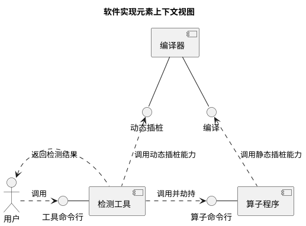

#### 逻辑视图

检测工具内部模块之间的逻辑视图如下：

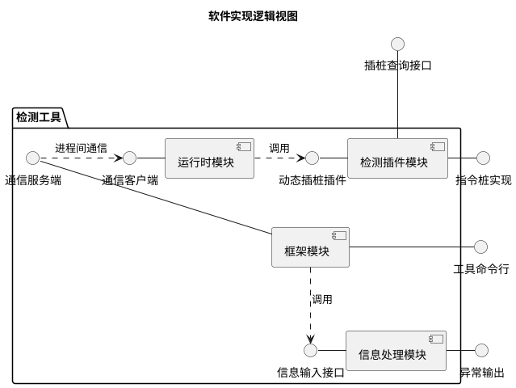

以表格形式输出软件单元清单：

| 软件单元 | 描述                  | 外部接口               | 内部接口      | 关系描述                                          |
| ---------- | ----------------------- | ------------------------ | --------------- | --------------------------------------------------- |
| 框架模块 | 工具整体流程控制，内部逻辑实现 | 工具命令行 | 通信服务端 | 实现工具命令行用于用户调用；实现通信服务端，用于与运行时模块传输数据；使用信息处理模块的信息输入接口； |
| 运行时模块 | 采集算子运行时数据并回传框架模块，内部逻辑实现 | 无 | 通信客户端 | 实现通信客户端，用于与框架模块传输数据；使用动态插桩插件完成动态插桩流程； |
| 信息处理模块 | 对信息进行检测，并输出检测结果，内部逻辑实现 | 异常输出 | 信息输入接口 | 实现异常输出；实现信息输入接口，用于接收框架传入的数据； |
| 检测插件模块 | 协同编译器完成插桩 | 插桩查询接口、指令桩实现 | 动态插桩插件 | 实现插桩查询接口，用于编译在静态插桩时查询要插桩的指令；实现指令桩，用于静态插桩链接；实现动态插桩插件，用于运行时模块动态插桩； |

通过以上逻辑视图软件单元清单表，可以清晰地描述软件设计元素的分解关系、外部接口到内部元素的实现/使用关系，用于软件单元清单的数字化解析和资产衔接追溯。

#### 软件实现单元设计

##### 框架模块单元设计

###### 功能描述

框架模块是异常检测工具执行的主干，用于组织和控制整个检测执行过程。具体可以总结以下功能：

1. 命令行参数解析与校验
2. `LD_PRELOAD` 环境变量设置与用户程序启动
3. 进程间通信
4. 算法模块创建与初始化
5. 异常信息收集与显示

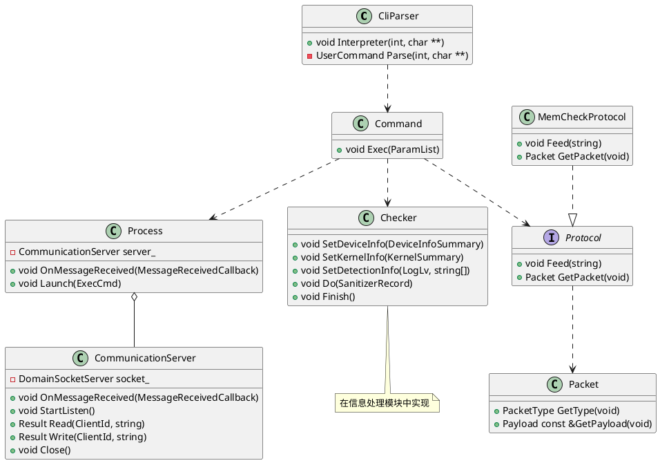

###### 处理流程描述

- 解析命令行参数，获取检测工具使能模式、用户二进制路径与启动命令；
- 根据使能模式选取对应的桩函数库，配置对应的 `LD_PRELOAD` 环境变量；
- Fork 子进程，在子进程中通过 `execvpe` 命令拉起用户程序，此时 `LD_PRELOAD` 配置的运行时桩函数库完成符号替换；
- 向用户进程发送使能模式；
- 运行时桩函数接收用户进程回传的操作记录；
- 运行时桩函数接收并解析检测运行时模块发送的文件映射信息；
- 将操作记录分发到已启用的检测工具；

###### 异常报告显示

- 需考虑不同检测类型对应检测结果的显示设计
- 有无定位信息时的显示区别

##### 运行时模块单元设计

###### 功能描述

本模块的功能是对用户程序运行时的某些函数做替换，拿到用户程序的运行时信息，并负责与检测工具进程通信交互，从而配合工具侧完成检测功能。

本模块提供的交付件为若干个动态库，以及配套的一些头文件。其中动态库会暴露需要劫持的函数符号，由工具在拉起用户程序前配置到 `LD_PRELOAD` 环境变量中，实现函数劫持。头文件为用户提供了一些 API，用户可在程序中插入 API 调用，为工具上报额外的信息辅助检测。

依据场景进行区分，运行时模块分别提供以下交付件：

1. CANN 软件栈内存检测场景
   - HAL 层内存检测：提供 `libascend_hal_hook.so`，用于 HAL 层内存检测；
   - ACL 层内存检测：提供 `libascend_acl_hook.so`，用于 ACL 层内存检测；提供 `acl.h` 头文件，用于额外上报 ACL 接口调用的代码文件和代码行；
2. AscendC 单算子场景
   - 提供 `libmssanitizer_injection.so` 用于 AscendC 单算子检测；
   - 提供 mstx 接口用于额外上报内存池信息，关于 mstx 接口的设计说明见 <font color="blue">TODO</font>
3. bisheng 算子场景
   - 提供 `libascend_san_stub.so` 用于 bisheng 算子内存检测；

以上场景提供的运行时模块功能是相似的，核心功能包括：

1. 提供进程间通信能力，与工具侧进行配置获取和信息上报；
2. 提供接口劫持能力，此部分通过实现待劫持接口的同名函数，并由工具拉起用户程序时配置 `LD_PRELOAD` 环境变量实现；
3. 提供设备信息获取和上报能力，包括卡号、芯片型号等；
4. 提供算子 kernel 上下文管理和 kernel 上下文信息上报能力，包括 blockDim、算子二进制、算子类型、算子 kernel name 等；
5. 提供信息记录内存管理能力；
6. 提供 `kernelLaunch` 参数拼接能力，使能 kernel 侧桩函数；
7. 提供动态插桩能力；

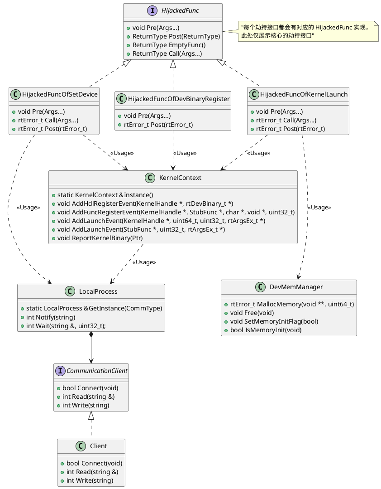

###### 处理流程描述

- 通信流程描述：
  
  1. 首次触发通信接口，初始化与服务端的信息传输 socket 通道，连接服务端获取检测模式，配置使能模式全局变量，作为桩函数是否生效的判断条件
  2. 获取设备信息并回传给服务端供检测工具完成初始化
  3. 根据通信协议，通过 socket 通道传输信息协议头和协议体
- 算子桩记录信息上报流程：
  
  1. 拦截 rtKernelLaunch 系列接口，算子 kernel 函数调用前，运行时模块通过调用 `__sanitizer_init` 接口完成 GM 内存的预分配，用于 kernel 函数内记录操作信息
  2. 将预分配的 GM 内存指针传递至设备侧，在 kernel 函数运行时完成操作信息的记录
  3. 算子 kernel 函数调用完成后，运行时模块将 GM 上记录的内容拷贝至 Host 侧内存。运行时模块根据协议将操作记录逐条解析，并通过通信流程将记录上报至检测工具侧
- 算子代码调用栈信息上报流程：
  算子代码调用栈信息显示依赖运行时模块和框架模块配合实现。其中运行时模块主要负责算子二进制的上报以及 pc current 指针的更新
- mstx 接口
  
  ```plantuml
  @startuml
  start
  :创建算子输入输出;
  :调用框架 API;
  split
    :创建内存池;
    split
      :调用 runtime API 分配内存;
      :上报 runtime 内存空间信息;
    split again
      :调用 mstx API 注册内存池;
      :上报内存池注册信息;
    end split
  split again
    :内存二次分配;
    :调用 mstx API 注册内存二次分配;
    :上报二次分配信息;
  end split
  :事件信息处理;
  note right: 需设计正确的优先级处理方法
  :执行异常检测;
  stop
  @enduml
  ```

###### 动态插桩功能设计

动态插桩检测功能依赖运行时模块中 Kernel 上下文管理、动态插桩和 Kernel 替换功能。

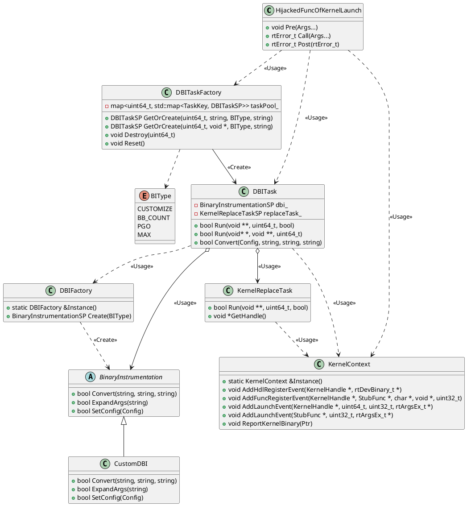

动态插桩发生在算子 Launch 之前，具体可以实现在 `HijackedFuncOfKernelLaunch` 系列接口的 `Pre` 函数中。首先调用 `DBITaskFactory` 工厂类实例化一个 `DBITask` 任务，用于执行动态插桩和 kernel 替换的任务。其中检测需要的动态插桩指令为 `BIType::CUSTOMIZE` 类型。`DBITask` 类中先调用 `DBIFactory` 工厂类生成动态插桩类型，并调用 `BinaryInstrumentation::Convert` 完成二进制动态插桩。此时动态插桩后的二进制在文件系统上，`KernelReplaceTask` 提供了用新生成的二进制替换当前算子的能力。`KernelReplaceTask` 需要通过 `KernelContext` 获取当前是动态算子还是静态算子，并选择对应的方法完成二进制注册和函数注册，并替换 `HijackedFuncOfKernelLaunch` 类中的算子二进制和函数指针。至此动态插桩完成，继续执行算子 Launch 逻辑执行的就是已插桩的算子。

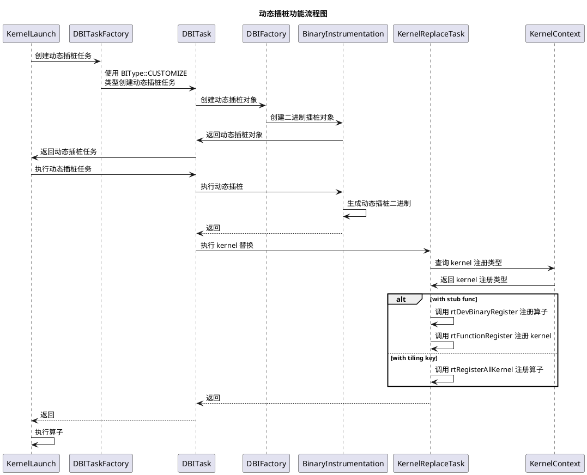

##### 信息处理模块单元设计

###### 功能描述

该模块主要用于分析收集到的信息，根据用户选择的模式进行异常检测，并向用户报告检测结果。提供的具体功能如下：

1. 提供检测算法的管理功能，需要对检测算法进行合适的抽象以方便扩展；
2. 提供检测算法任务序列生成功能；
3. 提供检测算法任务执行调度功能，支持算法间并行；
4. 提供运行时模块上报的桩记录预处理功能，将原始指令记录处理为统一的描述，作为检测算法的输入；
5. 提供内存检测算法，支持内存非法读写、非对齐访问、内存泄漏、非法释放等异常的检测；
6. 提供竞争检测算法，支持核间检测、流水间检测、流水内检测功能；
7. 提供未初始化检测算法。

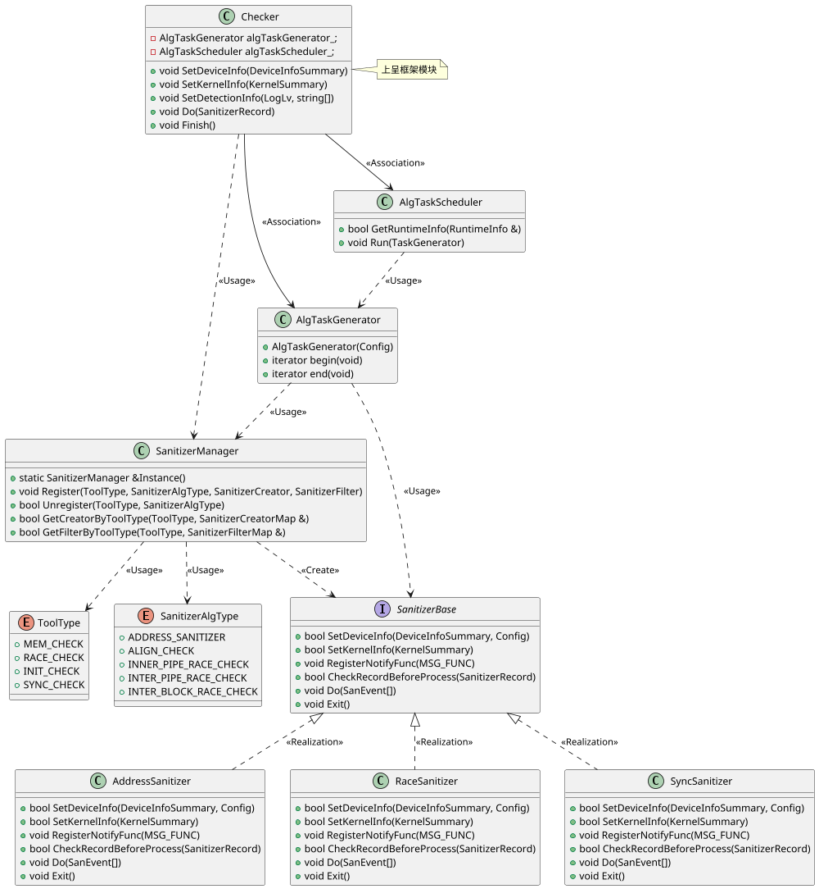

###### 检测算法管理

检测功能与检测算法之间存在一对多/多对一的关系，检测功能与算法的从属关系如下：

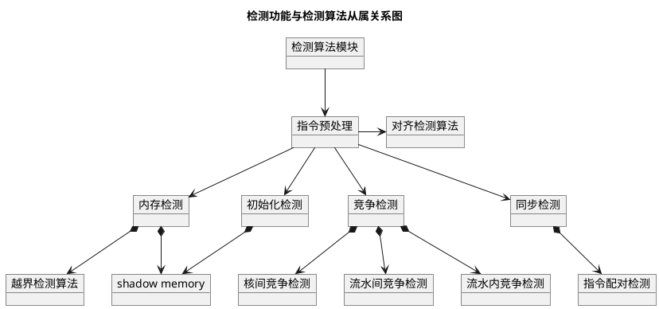

当前检测功能支持同时开启，因此直接按检测功能去执行算法会导致算法重复执行。因此需要检测算法管理模块不直接生成算法任务序列，而是提供算法注册、算法反注册、算法创建和过滤方法查询，由 `SanitizerManager` 类承载。

- 算法注册应发生在 `Checker` 类中，对于所有需要注册的算法，应提供检测功能类型 `ToolType`、检测算法类型 `SanitizerAlgType`、算法创建方法 `SanitizerCreator` 和算法过滤方法 `SanitizerFilter`。
- 在 `SanitizerManager` 类中，检测功能与检测算法的从属关系以 `map<ToolType, map<SanitizerAlgType, SanitizerCreator>>` 和 `map<ToolType, map<SanitizerAlgType, SanitizerFilter>>` 类型表示，并向外提供查询方法。算法创建和过滤方法查询被 `AlgTaskGenerator` 任务序列生成类调用，用于生成任务序列。

###### 算法任务序列生成

算法任务序列生成由 `AlgTaskGenerator` 类承载。在任务生成时需考虑：

- 当前检测功能支持同时开启，因此同一个算法可能被多次执行，相同算法需要合并。这里的合并需要考虑新生成的算法任务的执行效果与合并前两个任务的效果等价；
- 用户输入的命令行参数可能导致某些算法无法执行，算法需要过滤。

任务的创建方法和过滤方法从 `SanitizerManager` 类查询。

任务序列生成流程图如下：

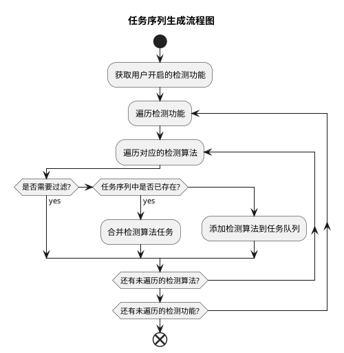

`AlgTaskGenerator` 类从实现上应该是一个可迭代对象，承诺向外提供 `begin` 和 `end` 接口，并且保证返回的迭代器至少应实现递增运算符 `operator++` 、不等号运算符 `operator!=` 和解引用运算符 `operator*`。迭代器解引用返回的应是算法执行方法，类型为 `std::function<void(Config)>`，供任务调度模块执行。

###### 算法任务执行调度

算法任务执行调度由 `AlgTaskScheduler` 类承载，提供了通用的任务调度和执行功能。任务执行调度设计的目的是充分利用 CPU 计算资源，缩短算法执行总耗时。本身不同算法之间相互独立，不存在数据依赖，因此设计采用线程池的方案，功能设计如下：

1. 初始化线程池，线程数量由执行环境的 CPU 核心数和用户输入的命令行参数决定
2. 一但存在空闲线程，从检测算法任务序列中依次取出任务绑定到池中的空闲线程执行
3. 空闲线程耗尽后队列阻塞等待
4. 一旦任务执行完成，线程重新作为空闲线程回到池中
5. 重复过程 2~4 直至序列中的所有任务执行完毕

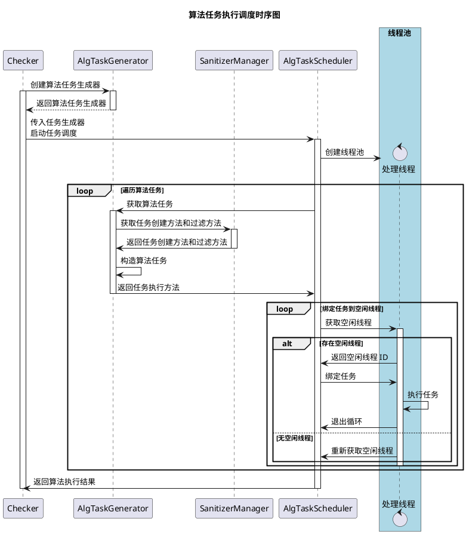

###### 内存检测算法

内存检测算法模块需要支持以下异常类型的检测：

| 异常类型 | 描述 | 支持内存类型 |
| -- | -- | -- |
| 多核踩踏 | 不同核写入的 GM 内存范围存在重叠 | GM |
| 非法读写 | 非法读异常对共享内存（GM）和片上内存（UB、L1、L0{ABC}）有不同的含义。共享内存有内存分配和释放的概念，因此共享内存上的非法读写是指指令访问了未申请的内存范围；片上内存没有申请和释放的概念，因此片上内存上的非法读写是指指令访问了该内存物理大小之外的范围 | GM、UB、L1、L0{ABC} |
| 非对齐访问 | 指令访问的内存地址不满足地址空间或数据类型对应的对齐要求 | GM、UB、L1、L0{ABC} |
| 内存泄漏 | 内存申请但未释放 | GM |
| 非法释放 | 对 GM 上未分配的地址进行释放，或对同一地址重复释放 | GM |
| 内存未使用 | 内存申请后未使用 | GM |
| 未初始化 | 内存申请后为未初始化状态，此时不对内存进行写入直接读取会得到未初始化的值 | GM、UB、L1、L0{ABC}、Private |

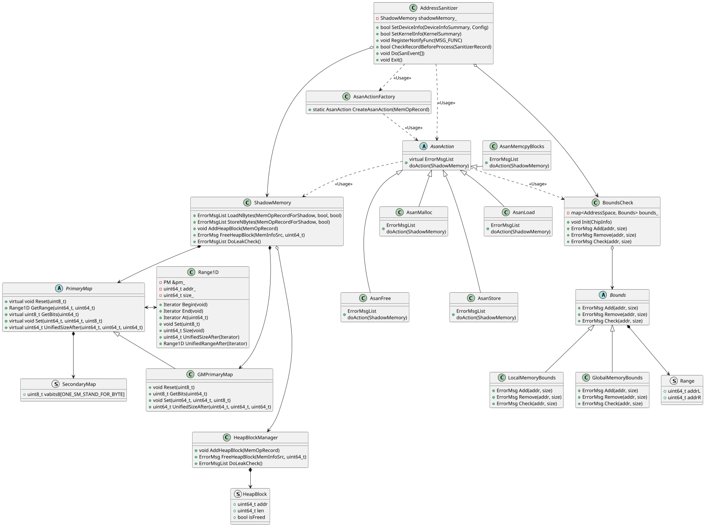

1. `Checker` 类用于执行检测。所有类型的内存操作记录通过该类的 `Checker::Do` 接口传入检测算法框架；
2. 以内存检测算法为例，`AddressSanitizer` 算法类的 `AddressSanitizer::Do` 接口接收 `Checker::Do` 接口传入的内存操作记录，并通过内存操作记录的类型创建不同的 `AsanAction` 子类进行检测算法；
3. `ShadowMemory` 类用于对内存进行逐字节建模，根据内存操作记录重现内存状态。不同 `AsanAction` 子类对象的 `DoAction` 接口会用不同的 `ShadowMemory` 接口完成内存操作的输入，`ShadowMemory` 内部完成检测并输出结果；
4. `BoundsCheck` 类用于越界检测，`BoundsCheck` 保存已分配的所有内存区间，并在 `Check` 接口被调用时检查传入的区间是否越界；

`AsanLoad` 用于表示读取的内存操作，对应到 `ShadowMemory` 类的 `LoadNBytes` 接口。此接口大致流程如下：

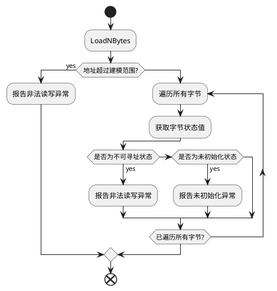

内存检测上下文切换

在多算子调用场景下，程序可能在 host 侧执行流程中的任意位置分配或释放 GM 内存，运行时的内存状态本身是维持在程序整个生命周期的。每个算子在对 kernel 侧指令进行越界检测时，默认都应以当前运行时的内存状态进行检测。adump 上报的 dfx 信息目的是标记更准确的算子可访问内存范围，只对当前算子有效。

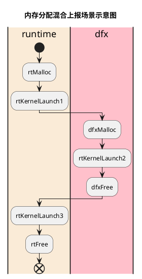

AddressSanitizer 应维护两份 BoundsCheck 实例，分别用于不同内存上下文的越界检测，并在适当阶段完成上下文切换。分别将两个上下文表示为 SCOPE_RUNTIME 和 SCOPE_DFX，则切换的逻辑表示如下：

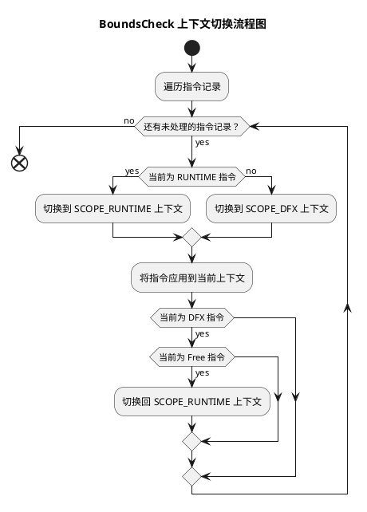

###### 竞争检测算法

TODO

###### 未初始化检测算法

TODO

###### 同步检测算法

同步检测用于检查算子程序中是否正确使用了同步原语，广义上包括 kernel 上的核间和流水间同步以及 host 侧的流同步等概念。当前检测工具支持的同步检测类型如下：

| 异常类型 | 描述 |
| -- | -- |
| set_flag/wait_flag 配对检测 | 用于检测 SIMD 架构上流水间同步指令的配对情况，如果 set_flag 或 wait_flag 缺少对应的配对指令，则报告异常 |

set_flag/wait_flag 配对检测需要记录 kernel 执行时所有的 set_flag/wait_flag 指令。指令的原型如下：

```c
void set_flag(pipe_t pipe, pipe_t tpipe, event_t eventID);
void wait_flag(pipe_t pipe, pipe_t tpipe, event_t eventID);
```

配对检测算法中，针对不同的源流水、目的流水、事件 ID 生成一条 set_flag/wait_flag 队列用于保存当前已出现的同步指令信息，具体算法流程如下：

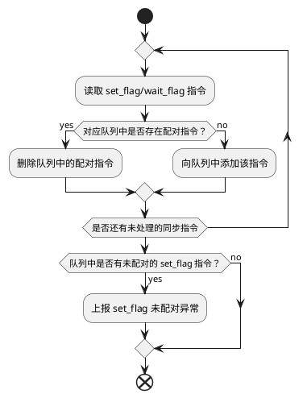

###### 算法间并行

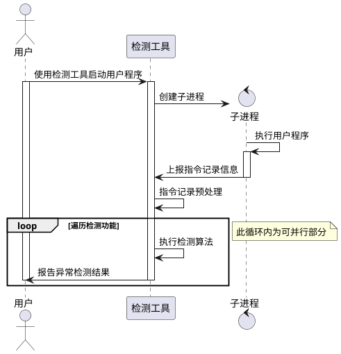

###### 共享内存

单机场景下，CANN 软件栈可以通过 IPC 系列接口实现卡间内存共享。device_0 向 device_1 共享内存的伪代码如下：

```c++
if (deviceId == 0) {
    // 开启与 1 卡的配对
    aclrtDeviceEnablePeerAccess(1, 0);
    // 0 卡分配内存
    uint8_t *gm = nullptr;
    aclrtMalloc((void **)&gm, 1024, ACL_MEM_MALLOC_HUGE_FIRST);
    // 为 gm 设定共享内存，并得到一个 name 用于其他进程获取映射地址
    char name[NAME_BUF_LEN] = {};
    rtIpcSetMemoryName(gm, 1024, name, NAME_BUF_LEN);
    // 设定可访问共享内存的进程 pid，此处需要传入 1 卡的 pid
    rtSetIpcMemPid(name, &pid, 1);
    // 共享内存使用完毕后释放内存
    aclrtFree(gm);
} else {
    // 开启与 0 卡的配对
    aclrtDeviceEnablePeerAccess(0, 0);
    // 通过 name 获取共享内存地址，此处的 name 从 0 卡对应线程获取
    void *gm = nullptr;
    rtIpcOpenMemory(&gm, name);
    // 在共享内存上执行算子
    kernel<<<blockDim, nullptr, stream>>>(gm);
    // 关闭共享内存
    rtIpcCloseMemory(gm)
}
```

流程示意如下：

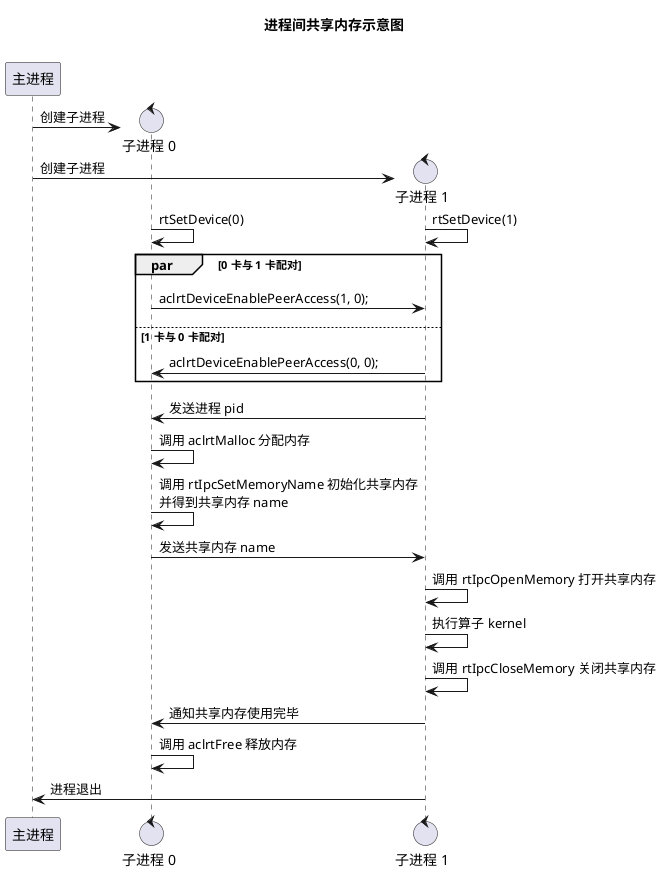

流程中发送进程 pid 和发送共享内存 name 两个步骤可以采用各种进程间通信方式实现，具体细节不在本章节讨论范围之内。

共享内存的基本原理是在一个设备（Device0）上分配物理内存，并将其映射到另一个设备（Device1）的虚拟地址空间中，Device1 可以直接通过虚拟地址访问 Device0 的内存。对于本工具的信息处理模块，当前已支持多卡建模，需要考虑的就是如何实现正确的状态同步。本工具中 ShadowMemory 建模本身就是对虚拟内存空间的建模，因此需要在打开共享内存时，将 Device0 的内存状态同步至 Device1。

共享内存感知的实现需要运行时模块和信息处理模块的配合。运行时模块中需要感知的共享内存相关接口原型如下：

```c++
/**
 * @ingroup dvrt_mem
 * @brief make memory shared interprocess and assigned a name
 * @param [in] ptr    device memory address pointer
 * @param [in] name   identification name
 * @param [in] byteCount   identification byteCount
 * @return RT_ERROR_NONE for ok
 * @return RT_ERROR_INVALID_VALUE for error input
 * @return RT_ERROR_DRV_ERR for driver error
 */
RTS_API rtError_t rtIpcSetMemoryName(const void *ptr, uint64_t byteCount, char_t *name, uint32_t len);

/**
 * @ingroup dvrt_mem
 * @brief open a interprocess shared memory
 * @param [in|out] ptr    device memory address pointer
 * @param [in] name   identification name
 * @return RT_ERROR_NONE for ok
 * @return RT_ERROR_INVALID_VALUE for error input
 * @return RT_ERROR_DRV_ERR for driver error
 */
RTS_API rtError_t rtIpcOpenMemory(void **ptr, const char_t *name);

/**
 * @ingroup dvrt_mem
 * @brief close a interprocess shared memory
 * @param [in] ptr    device memory address pointer
 * @param [in] name   identification name
 * @return RT_ERROR_NONE for ok
 * @return RT_ERROR_INVALID_VALUE for error input
 * @return RT_ERROR_DRV_ERR for driver error
 */
RTS_API rtError_t rtIpcCloseMemory(const void *ptr);
```

工具侧对共享内存信息的处理流程如下：

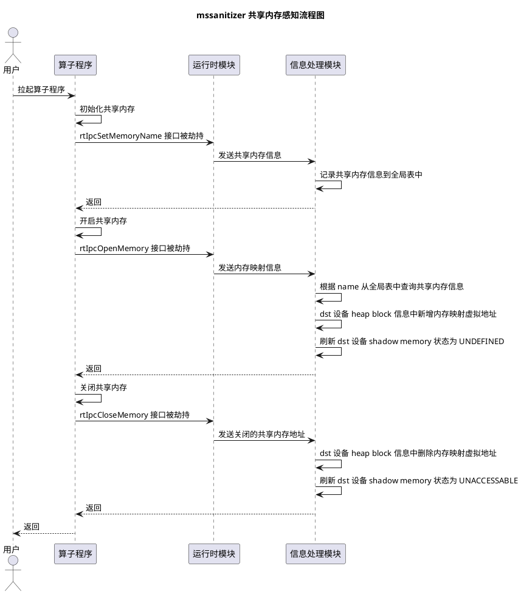

涉及运行时模块和工具侧之间的信息通信协议设计如下：

```c++
/** @brief 共享内存设置信息
 * 在 `rtIpcSetMemoryName` 被调用后发送，包含共享内存源设备信息
 */
struct IPCMemorySetInfo {
    uint64_t addr;  // 共享内存在源设备上的地址
    uint64_t size;  // 共享内存的长度
    char name[64];  // 共享内存被设定的名称
};

/** @brief 共享内存映射信息
 * 在 `rtIpcOpenMemory` 被调用后发送，包含共享内存目的设备的信息
 */
struct IPCMemoryMapInfo {
    uint64_t addr;  // 共享内存在目的设备上打开后的虚拟地址
    char name[64];  // 共享内存被设定的名称
};

/** @brief 共享内存解除映射信息
 * 在 `rtIpcCloseMemory` 被调用后发送
 */
struct IPCMemoryUnmapInfo {
    uint64_t addr;  // 要解除的共享内存虚拟地址
};

enum class IPCMemoryRecordType {
    SET_INFO = 0,
    MAP_INFO,
    UNMAP_INFO
};

struct IPCMemoryRecord {
    IPCMemoryRecordType type;
    union {
        IPCMemorySetInfo setInfo;
        IPCMemoryMapInfo mapInfo;
        IPCMemoryUnmapInfo unmapInfo;
    };
};

enum class RecordVersion {
    MEMORY_RECORD = 0,
    KERNEL_RECORD,
    IPC_RECORD
};

struct SanitizerRecord {
    RecordVersion version;
    union {
        MemOpRecord memoryRecord;
        KernelRecord kernelRecord;
        IPCMemoryRecord ipcRecord;
    } payload;
};
```

共享内存信息感知相关的类图如下：

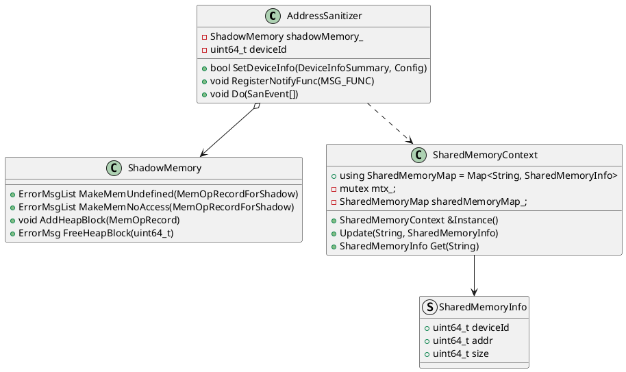

工具侧接收到 IPC 信息后，传到 `AddressSanitizer` 类中进行处理和信息维护。处理流程图如下：

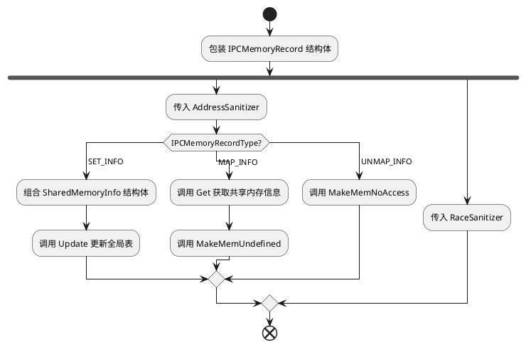

此功能在实现设计时需要注意如下：

1. `SharedMemoryContext` 为所有 `Checker` 实例线程都可以访问的全局唯一对象，维护全局状态时需要加锁做好同步；
2. 考虑后续能需要在共享内存下实现 ShadowMemory 状态的映射，需要将共享内存感知做在 `AddressSanitizer` 类中。`ShadowMemory` 类实现局部的内存状态导入和导出，从而实现共享内存时的初始化检测

###### 异常信息显示设计

根据异常定位信息的详细程度，可将定位信息分为三种类型：

- 异常调用栈
- 文件名与行号
- 无定位信息

以非法读写异常信息为例。异常调用栈显示为：

```
====== ERROR: illegal read of size 224
======    at 0x12c0c0015000 on GM
======    in block aiv(0) on device 0
======    code in pc current 0x77c (serialNo:10)
======    #0 ${ASCEND_HOME_PATH}/compiler/tikcpp/tikcfw/impl/dav_c220/kernel_operator_data_copy_impl.h:58:9
======    #1 ${ASCEND_HOME_PATH}/compiler/tikcpp/tikcfw/inner_interface/inner_kernel_operator_data_copy_intf.cppm:58:9
======    #2 ${ASCEND_HOME_PATH}/compiler/tikcpp/tikcfw/inner_interface/inner_kernel_operator_data_copy_intf.cppm:443:5
======    #3 illegal_read_and_write/illegal_read_and_write_kernel.cpp:18:5
```

文件名与行号：

```
====== ERROR: illegal read of size 224
======    at 0x12c0c0015000 on GM
======    in block aiv(0) on device 0
======    code in illegal_read_and_write/illegal_read_and_write_kernel.cpp:18 (serialNo:10)
```

无定位信息：

```
====== ERROR: illegal read of size 224
======    at 0x12c0c0015000 on GM
======    in block aiv(0) on device 0 (serialNo:10)
```

##### 检测插件模块单元设计

本模块通过插件的形式提供给毕昇编译器调用，使编译器能在算子代码或二进制正确的位置插入正确的桩函数，从而实现检测工具对算子 kernel 内的异常检测。根据插桩时机是发生在源码编译时还是运行时，可以分为静态插桩和动态插桩；根据桩函数的行为是仅记录内存操作信息发回工具侧检测，还是直接在桩函数内执行检测算法，可以分为 Host 侧检测和 Device 侧检测。两个维度可以进行组合以适应各种检测场景，目前检测工具提供以下三种插件：

- Host 侧检测的静态插桩插件
- Host 侧检测的动态插桩插件
- Device 侧检测的动态插桩插件

###### 处理流程描述

本章节将从插桩时机（静态插桩、动态插桩）和检测时机（Host 侧检测、Device 侧检测）两个维度分别说明处理流程上的差异。

- 静态插桩
  静态插桩发生在算子源码编译时，编译器在源码的指令调用位置插入桩函数调用。优点是可以获得源码调试信息，检测异常信息可以指向异常发生的调用栈；缺点是需要对算子进行重新编译。适合单算子下对具体的异常进行分析。静态插桩模式提供的两种类型的交付件：
  
  - 一是插桩查询库 `libsanitizer_api.so`，架构与 host 宿主机一致，用于编译器在编译算子过程中查询插桩策略
  - 二是桩实现库 `libsanitizer_stub_dav-xxx.a`，`xxx` 表示编译此桩实现库使用的架构，编译器在链接时应根据算子的架构选择对应的桩实现库
  
  插件的调用流程时序图如下：
  
  ```plantuml
  @startuml
  actor 用户 as user
  participant "编译器" as compiler
  participant "编译器插件" as plugin
  participant "算子工程" as project
  participant "检测工具" as sanitizer
  user -> compiler: 编译算子
  activate user
  activate compiler
  loop 遍历算子代码
   compiler -> project: 读取算子代码
   activate project
   project -> compiler: 返回算子代码
   deactivate project
   compiler -> plugin: 查询插桩策略
   activate plugin
   plugin -> compiler: 返回插桩策略
   compiler -> plugin: 获取桩实现
   plugin -> compiler: 返回桩实现
   deactivate plugin
   compiler -> compiler: 根据策略插桩
  end
  compiler -> user: 返回算子二进制
  deactivate compiler
  user -> sanitizer: 对算子执行异常检测
  activate sanitizer
  sanitizer -> project: 拉起算子可执行文件
  activate project
  project -> sanitizer: 上报指令事件信息
  deactivate project
  sanitizer -> user: 报告检测结果
  deactivate sanitizer
  deactivate user
  @enduml
  ```
  
  1. 编译器编译算子工程代码时，遍历算子 kernel 文件代码；
  2. 根据算子代码中的指令调用向编译器插件查询对应的插桩策略和桩实现，并在对应位置插入桩函数实现；
  3. 编译器完成算子工程编译，生成算子可执行文件；
  4. 用户通过检测工具拉起步骤3中生成的算子可执行文件，算子运行过程中由桩函数记录并上报内存操作信息，检测工具完成异常检测。
- 动态插桩
  动态插桩发生在算子执行时，通过劫持 `rtKernelLaunch` 系列接口，对待执行的算子 kernel 二进制进行插桩并替换，从而实现动态插桩流程。优点是不需要重新编译算子，用户对使用流程感知更小；缺点是不支持显示调用栈信息。适合整网检测下定界异常算子。
  
  动态插桩插件也需要提供插桩查询库（host部分）和桩实现（kernel部分）。但是利用混合架构，动态插桩插件只提供一个交付件`libsanplugin_boundscheck.so`。
  
  该交付件结构如下图所示：
  
  
  其中 `libsanplugin_boundscheck.so` 插件整体是一个 host 侧的动态库，架构与 host 宿主机一致。动态库中提供了 `MSBitInit` 接口用于生成插桩信息，会在动态插桩流程中被调用。动态库中会包含若干个名为 `dav-xxx` 的段，用于保存对应架构的指令桩实现。
  
  插件与工具配合进行动态插桩的流程如下：
  
  ```plantuml
  @startuml
  actor 用户 as user
  participant "用户算子" as kernel
  participant "检测工具" as sanitizer
  participant "基础组件" as injection
  participant "动态插桩插件" as plugin
  participant "编译器" as compiler
  user -> sanitizer: 使用检测工具拉起算子
  activate user
  activate sanitizer
  sanitizer -> kernel: 拉起用户算子
  activate kernel
  kernel -> kernel: 算子执行
  kernel -> injection: runtime 接口被劫持
  deactivate kernel
  activate injection
  injection -> injection: dump 算子二进制
  injection -> plugin: 调用 MSBitInit
  activate plugin
  plugin -> injection: 生成 ctrl.bin
  injection -> plugin: dump 插件的 .dav 段
  plugin -> injection: 生成桩实现二进制
  deactivate plugin
  injection -> compiler: 调用 ld.lld 链接桩实现和算子 kernel
  activate compiler
  compiler -> injection: 生成桩实现和算子 kernel 链接产物
  injection -> compiler: 调用 bisheng-tune 生成插桩二进制
  compiler -> injection: 生成二进制
  deactivate compiler
  injection -> injection: 注册二进制
  injection -> injection: 执行算子
  injection -> sanitizer: 上报指令记录
  deactivate injection
  sanitizer -> sanitizer: 执行异常检测
  sanitizer -> user: 报告异常结果
  deactivate user
  deactivate sanitizer
  @enduml
  ```
- Host 侧检测
  Host 侧检测流程中，桩函数只负责记录 kernel 内的内存操作记录，kernel 执行结束后将记录上报至工具侧进行检测。Host 侧一般具有更好的 CPU 性能，因此我们可以设计更复杂的检测算法，因此 Host 侧检测作为全面的检测方案。检测算法的设计见检测算法模块设计章节。
- Device 侧检测
  在整网场景下，我们希望能充分利用 Device 上的 Scalar 计算资源直接在 Kernel 运行时完成一些简单的检测。此时桩函数的行为不再是保存内存操作记录，而是直接在桩函数内运行简单的检测算法对指令行为进行检测，并将检测结果保存到 GM 中，上报给工具侧。该方案减少了算子执行流程与工具的耦合，适用于在整网场景的检测，尤其是图模式等下沉场景。
  
  Device侧检测的流程大体可分为三步：
  
  1. Tensor 信息的获取与传递。Tensor 信息包含算子输入输出 tensor 的长度和地址，此部分信息的来源和 Host 侧检测时使用的  Tensor 信息来源一致。区别是 Host 侧检测时 Tensor 信息会上报给工具，而 Device 侧检测时 Tensor 信息需要传递给桩函数使用；
  2. 越界检测。检测算法需要对算子 kernel 内的内存行为进行解析，并与步骤一中传入的 Tensor 信息范围进行比较，判定内存行为是否合法；
  3. 检测结果上报。步骤二中检测算法若发现内存操作存在非法读写问题，则会将检测结果写入 GM 中，待 Kernel 运行结束后将检测结果上报至工具侧展示。
- Tensor 信息的获取与传递
  Tensor 信息的获取和 Host 侧检测一致。rtKernelLaunch 场景下 Tensor 信息来源于实际的 rtMalloc 接口，rtKernelLaunchWithHandleV2 和 rtKernelLaunchWithFlagV2 场景下来源于 rtSetException 接口。
  
  Tensor 信息传递涉及 Host->Device 方向上的通信。我们一般认为算子对其输入和输出 tensor 对应的 GM 内存区域具有合法访问的权限，这些区域可以抽象成若干个成对的地址和长度来表示。其中一组地址和长度可以用 TensorInfo 表示：
  
  ```c++
  /// Tensor 信息结构体
  struct TensorInfo {
    uint64_t addr;
    uint64_t size;
  };
  ```
  
  工具侧要传递给 kernel 侧的信息由以下结构体承载：
  
  ```c++
  struct SanitizerHead {
      uint64_t tensorNum;
      uint64_t reserved[15];
  };
  ```
  
  在 rtKernelLaunch 执行前，我们可以将所有可访问的 GM 内存区域信息写入预分配的 GM 的指定位置，传递给 kernel 函数中的检测算法使用。TensorInfo 信息在 GM 上的排列如下：
  
- 检测算法管理
  当前 Device 侧检测需要支持越界检测和对齐检测，需要设计合适的算法管理方法，满足以下设计目标：
  
  - 可根据工具侧传入的检测功能使能情况开启对应的检测算法
  - 检测算法管理易于后续扩展新算法
- 记录预处理
  与 Host 侧检测相同，Device 侧检测一样需要将记录处理成若干连续的内存读写后再进行检测。考虑 Device 侧的特性，workspace 较有限，设计采用边处理边检测的方式。
- 越界检测
  越界检测主要涉及 Device 上的越界检测算法，需要结合昇腾设备的特点对算法进行设计：
  
  1. Device 上的 Scalar 算力有限，应考虑检测算法本身对算子运行耗时的影响；
  2. Kernel 函数运行在设备运行时上，本身不支持容器模板等 c++ 标准库特性；
  3. 桩函数内部的栈变量在退出函数时会被析构，需要持久化的中间结果要在 GM 上临时保存；
  
  此处采用遍历 TensorInfo 并依次判定内存访问是否在有效内存范围内的方法。
  
  ```plantuml
  @startuml
  start
  :获取指令入参;
  :指令预处理为连续内存事件;
  repeat :遍历内存事件;
    repeat :依次与 TensorInfo 比较
      :写入检测结果;
    repeat while (是否还有未比较的 TensorInfo?)
  repeat while (是否还有未处理的内存事件?)
  stop
  @enduml
  ```
- 检测结果上报
  检测结果需要依次写入预分配的 GM 内存，GM 内存开头需要一个 SanitizerResultHead 结构体用于保存当前已记录的检测结果条数和当前写入偏移总量。结构体设计如下：
  
  ```c++
  /// SanitizerResultHead 检测结果信息头
  struct SanitizerResultHead {
    uint64_t reportCount;  // 保存当前已处理的检测结果条数
    uint64_t writeCount;   // 保存当前已写入的检测结果条数
    uint64_t recordOffset; // 保存当前已处理检测结果总长度
    uint64_t writeOffset;  // 保存当前已写入的偏移总量
    uint64_t reserved[12];
  };
  ```
  
  由于 GM 内存是在 Host 侧申请的，Kernel 内无法重新分配，因此需要特别处理当检测结果条数过多，超过 GM 内存能保存的上限的情况。当发现检测结果超过 GM 上限时，不再向 GM 继续写入，writeCount 计数不再更新，reportCount 继续更新。这样当最终结果上报时可以通过判断 writeCount 和 reportCount 确定有多少结果丢失。
  
  检测结果 SanitizerResult 结构体定义如下：
  
  ```c++
  /// 检测结果类型
  enum class ResultType : uint8_t {
      ILLEGAL_ACCESS = 0,
      MISALIGN
  };
  
  /// 访问方式
  enum class AccessType : uint8_t {
      READ = 0,
      WRITE
  };
  
  /// SanitizerResult 检测结果
  struct SanitizerResult {
      uint64_t blockIdx;
      uint64_t addr;
      uint64_t size;
      ResultType resultType;
      AccessType accessType;
  };
  ```
  
  为防止写入时发生核间竞争，为每个 block 分配独立的一块 GM 内存用于保存检测结果。每个 block 对应的 GM 内存保存检测结果的格式如下：
  
  ```plantuml
  @startjson
  {
    "sanitizerHead": {
      "tensorNum": "uint64_t",
      "reserved": "uint64_t[15]"
    },
    "tensorInfos": [
      {
        "addr": "uint64_t",
        "size": "uint64_t"
      }
    ],
    "sanitizerResults": [
      {
        "sanitizerResultHead": {
          "reportCount": "uint64_t",
          "writeCount": "uint64_t",
          "recordOffset": "uint64_t",
          "writeOffset": "uint64_t",
          "reserved": "uint64_t[12]"
        },
        "sanitizerResults": [
          {
            "blockIdx": "uint64_t",
            "addr": "uint64_t",
            "size": "uint64_t",
            "resultType": {
              "ILLEGAL_ACCESS": 0,
              "MISALIGN": 1
            },
            "accessType": {
              "READ": 0,
              "WRITE": 1
            }
          }
        ],
        "padding": {
          "size": "up to cache size"
        }
      }
    ]
  }
  @endjson
  ```

### 接口

#### 总体设计

本工具中各模块的接口差异较大，因此本章节中将分模块对接口设计进行说明

#### 设计目标

不涉及

#### 设计约束

不涉及

#### 技术选型

不涉及

#### 框架模块单元

描述软件单元对其它软件单元提供的接口（内部接口）。

##### 接口描述

框架模块提供两类接口。对外提供命令行接口，对内提供进程间通信的服务端接口。该接口与运行时模块进行通信。

##### 接口信息模型

框架模块涉及与运行时模块的进程间通信，通信协议在[运行时模块接口信息模型](#process-communication-protocol-desc)中描述，此处不再赘述。

##### 接口清单

<a></a>

###### 工具命令行选项表

| 命令 | 功能描述 |
| -- | -- |
| -h, --help | 显示工具使用帮助 |
| -v, --version | 查询版本号信息 |
| -t, --tool <name>	| 指定要使能的检测工具模块，可选值为：<br>1. memcheck 内存检测模块<br>2. racecheck 竞争检测模块<br>3. initcheck 初始化检测模块<br>4. synccheck 同步检测模块<br>可以通过 `|` 分隔来同时指定启用多个检测模块（如：`memcheck|racecheck`）。默认启用所有检测模块 |
| --log-file <file> | 保存log信息到指定文件中，不指定则打印 |
| --log-level <level> | 指定打印级别，默认为error |
| --max-debuglog-size <size> | 指定单个工具 debug 日志文件的大小 |
| --kernel-name <string> | 对指定的kernel name进行检测（仅支持图下沉模式）。默认对全量kernel进行检测 |
| --block-id <uint> | 检测指定核心的内容，当使能该特性时，跨核检测内容被抑制。默认检测所有核心 |
| --cache-size <uint> | 单位：MB，指定每个核心的缓存资源分配量（不含保护区域）。默认100 |

内存检测工具子选项表：

| 命令 | 功能描述 |
| -- | -- |
| --leak-check <yes\|no> | 设置是否要启用内存泄漏检测 |
| --check-unused-memory <yes\|no> | 设置是否要启用内存分配但未使用检测 |
| --check-device-heap <yes\|no> | 设置检查 HAL 接口使用是否存在内存异常 |
| --check-cann-heap <yes\|no> | 设置检查ACL 接口使用是否存内存异常 |

<a></a>

###### 进程间通信接口

```c++
class CommunicationServer {
public:
    using ClientId = std::size_t;
    /** 消息处理回调
     * StartListen 后 Server 内会起一个线程监测消息，接收到消息后会传给此回调处理
     * @param CommunicationServer& - 在回调中调用者可以通过此 server 实例向客户端发送消息
     * @param ClientId - 消息来源的对应的客户端 ID
     * @param std::string - 接收到的消息
     */
    using MessageReceivedCallback = std::function<void(CommunicationServer&, ClientId, std::string)>;
    using ClientConnectHook = std::function<void(ClientId)>;

    /** 回调函数
     * 通知服务器已经读完所有数据
     */
    void OnMessageReceived(const MessageReceivedCallback &callback);

    /** 启动服务端
     * @description 手动启动服务端，在此之前可以设置 SetClientConnectHook
     * 回调，防止回调设置前一些客户端已经连接
     */
    void StartListen();

    /** 从客户端读取数据
     * @description 当客户端未写入数据时阻塞，目前超时时间固定为 1s
     * @param clientId 要读取的客户端 id
     * @param msg 读取到的数据，当接口返回 -1 时为无效值
     * @return -1 表示读取失败或超时
     *         >0 表示读取成功，并返回读取到的数据长度
     */
    Result Read(ClientId clientId, std::string &msg);

    /** 向客户端写入数据
     * @description 当缓冲区满时阻塞
     * @param clientId 要写入的客户端 id
     * @param msg 要写入的数据
     * @return -1 表示写入失败
     *         >0 表示写入成功，并返回已写入的数据长度
     */
    Result Write(ClientId clientId, std::string const& msg);

    /** 设置客户端连接通知回调函数
     * @description 当有新客户端连接时，func 回调会被调用，并传入新客户端的
     * id。需要注意回调函数是在一个另一个线程中被调用，如果回调函数中捕获了
     * 其他变量，需要调用者自己在回调函数中对变量加锁处理线程竞争问题
     * @param func 通知回调函数
     */
    void SetClientConnectHook(ClientConnectHook &&hook);
};

class CommunicationClient {
public:
    /** 连接服务端
     * @description 服务端未启动时连接会失败，需要调用者自行处理重试
     */
    Result ConnectToServer();

    /** 从服务端读取数据
     * @description 当服务端未写入数据时阻塞，目前超时时间固定为 1s
     * @param msg 读取到的数据，当接口返回 -1 时为无效值
     * @return -1 表示读取失败或超时
     *         >0 表示读取成功，并返回读取到的数据长度
     */
    Result Read(std::string &msg);

    /** 向服务端写入数据
     * @description 当缓冲区满时阻塞
     * @param msg 要写入的数据
     * @return -1 表示写入失败
     *         >0 表示写入成功，并返回已写入的数据长度
     */
    Result Write(std::string const &msg);
};
```

#### 运行时模块

##### 接口描述

运行时模块主要通过接口劫持完成功能，劫持涉及的接口包括 HAL、Runtime、ACL 等 CANN 软件栈运行时接口，以及 mstx 这类工具自定义接口。另一方面，运行时模块需要与框架模块进行进程间通信，涉及进程间通信协议。

###### mstx 接口

针对 mssanitizer 而言，mstx 用于让用户程序可以向检测工具上报内存相关的额外信息，辅助检测工具完成更准确的检测，或完成用户定制化的检测。

对于 kernel 内的指令，mssanitizer 需要结合 host 侧的内存分配信息进行 GM 越界读写检测。在内存池场景下，框架会一次性分配大量内存，并通过二次分配的方式为算子划分可访问区域。二次分配并非使用 runtime API，因此工具无法直接感知。

如果直接对框架中二次分配相关接口进行劫持，需要考虑 ABI 稳定性，以及不同框架需要定制劫持接口的问题。参照友商的 tx 接口，提供了内存池注册和二次分配注册的感知能力，能满足本工具的诉求。因此提供类似的 mstx 系列 API，辅助 mssanitizer 工具完成检测。

需要的具体功能点如下：

1. 支持 mstx 域，提供隔离 mstx 接口事件的能力。调用者可以根据需要创建不同的域，防止不同域间的接口事件冲突，并且可以通过域区分或者过滤事件。并且提供 global 域作为默认的全局域。
2. 支持将内存区域注册为内存池，并支持将已注册的内存池进行注销。
3. 支持批量将内存池上的区域进行二次分配注册，并支持将已注册的二次分配注销。

- 内存池注册
  注册时机：框架在调用 runtime API 分配内存并将该内存区域视为内存池时，就应该调用内存池注册接口；在调用 runtime API 释放内存时，就应该调用注销接口。
  - 工具侧需要感知内存区域是否是内存池，只有内存池上才可以进行二次分配，否则工具应报告 bad alloc 异常；
  - 每次内存池注册都应该有配对的注销操作，否则工具应报告 memory leak 异常。
- 二次分配注册
  注册时机：框架在内存池为算子的输入、输出等分配内存时，应调用二次分配注册。
  注册的二次分配区域就是算子执行可访问的区域，用于算子内存越界检测。
  - 工具侧需要感知内存二次分配，内存池上的内存必须要经过二次分配才可以被访问，否则工具应报告越界读写异常；
  - 二次分配必须在内存池范围内，否则工具应报告 bad alloc 异常；
  - 二次分配必须有配对的注销操作，否则工具应报告 memory leak 异常；

<a></a>

##### 接口信息模型

运行时模块需要与框架模块进行进程间通信，通信模型通过如下流程图描述。工具启动时框架模块向运行时模块传输一次工具配置，用于控制运行时的行为。随后运行时模块将运行时信息逐条上报给框架，发送的流程为先发送一个协议头 `PacketType`，再发送对应的载荷。载荷类型有两种，一种是定长载荷由结构体表示，如 `DeviceSummary`、`KernelSummary` 等；一种是不定长载荷由字节流 `char[]` 表示。

```plantuml
@startuml
title "框架模块与运行时模块间通信流程图"
participant 框架模块 as framework
participant 运行时模块 as runtime

framework -> runtime: 传输工具配置 SanitizerConfig
loop 运行时信息
  alt 发送设备信息
    runtime -> framework: PacketType::DEVICE_SUMMARY
    runtime -> framework: DeviceSummary
  else 发送算子信息
    runtime -> framework: PacketType::KERNEL_SUMMARY
    runtime -> framework: KernelSummary
  else 发送算子二进制
    runtime -> framework: PacketType::KERNEL_BINARY
    runtime -> framework: char[]
  else 发送运行时日志信息
    runtime -> framework: PacketType::LOG_STRING
    runtime -> framework: char[]
  else 发送 Host 侧内存操作记录
    runtime -> framework: PacketType::MEMORY_RECORD
    runtime -> framework: HostMemRecord
  else 发送 Kernel 侧内存操作记录
    runtime -> framework: PacketType::KERNEL_RECORD
    runtime -> framework: char[]
  else 发送 IPC 操作记录
    runtime -> framework: PacketType::IPC_RECORD
    runtime -> framework: IPCMemRecord
  end
end
@enduml
```

协议结构体设计如下：

```c++
// 工具配置
struct SanitizerConfig {
    bool defaultCheck;
    bool memCheck;
    bool raceCheck;
    bool initCheck;
    bool syncCheck;
    bool checkDeviceHeap;
    bool checkCannHeap;
    bool leakCheck;
    bool checkUnusedMemory;
    int16_t checkBlockId = CHECK_ALL_BLOCK;
    uint32_t cacheSize = DEFAULT_CACHE_SIZE;
    char pluginPath[PLUGIN_PATH_MAX];
    char kernelName[KERNEL_NAME_MAX];
};
```

```c++
// 通信协议头
enum class PacketType : uint32_t {
    // 各工具通用的协议
    DEVICE_SUMMARY = 0,  // 设备信息
    KERNEL_SUMMARY,      // 算子运行时信息
    KERNEL_BINARY,       // 算子二进制
    LOG_STRING,          // 子进程日志信息

    // sanitizer 特有的协议
    MEMORY_RECORD = 1000,     // Host 侧内存操作记录
    KERNEL_RECORD,            // Kernel 侧指令记录
    IPC_RECORD,               // IPC 类操作记录

    // tracekit 特有的协议
    TEXT = 2000,

    INVALID = ~0U,
};
```

```c++
// 设备信息 payload
struct DeviceSummary {
    uint32_t device;
    uint32_t blockSize;
    uint32_t blockNum;
    int32_t deviceId;
};

// 算子运行时信息 payload
struct KernelSummary {
    uint64_t pcStartAddr;
    uint32_t blockDim;
    KernelType kernelType;
    bool isKernelWithDBI = false;
    char kernelName[KERNEL_NAME_MAX];
};

// Host 侧内存操作记录 payload
struct HostMemRecord {
    MemOpType type;
    MemInfoSrc infoSrc;
    uint64_t srcAddr;
    uint64_t dstAddr;
    uint64_t memSize;
};

// IPC 操作记录类型
enum class IPCMemoryRecordType {
    SET_INFO = 0,
    DESTROY_INFO,
    MAP_INFO,
    UNMAP_INFO
};

// 内存共享者创建信息 payload
struct IPCMemorySetInfo {
    uint64_t addr;  // 共享内存在源设备上的地址
    uint64_t size;  // 共享内存的长度
    char name[64];  // 共享内存被设定的名称
};

// 内存共享者销毁信息 payload
struct IPCMemoryDestroyInfo {
    char name[64];  // 共享内存被设定的名称
};

// 内存共享映射信息 payload
struct IPCMemoryMapInfo {
    uint64_t addr;  // 共享内存在目的设备上打开后的虚拟地址
    char name[64];  // 共享内存被设定的名称
};

// 内存共享解除信息 payload
struct IPCMemoryUnmapInfo {
    uint64_t addr;  // 要解除的共享内存虚拟地址
};

struct IPCMemRecord {
    IPCMemoryRecordType type;
    union {
        IPCMemorySetInfo setInfo;
        IPCMemoryDestroyInfo destroyInfo;
        IPCMemoryMapInfo mapInfo;
        IPCMemoryUnmapInfo unmapInfo;
    };
};
```

<a></a>

##### 接口清单

###### HAL 接口

| 接口 | 描述 |
| -- | -- |
| `drvError_t halMemAlloc(void **pp, unsigned long long size, unsigned long long flag);` | 记录并上报内存分配信息 |
| `drvError_t halMemFree(void *pp);` | 记录并上报内存释放信息 |
| `drvError_t drvMemsetD8(DVdeviceptr dst, size_t destMax, uint8_t value, size_t num);` | 记录并上报内存初始化信息 |
| `drvError_t drvMemcpy(DVdeviceptr dst, size_t destMax, DVdeviceptr src, size_t byteCount);` | 记录并上报内存拷贝信息 |
| `drvError_t halMemCpyAsync(DVdeviceptr dst, size_t destMax, DVdeviceptr src, size_t byteCount, uint64_t *copyFd);` | 记录并上报异步内存拷贝信息 |
| `drvError_t halMemcpy2D(MEMCPY2D *pCopy);` | 记录并上报 2D 内存拷贝信息 |

###### ACL 接口

| 接口 | 描述 |
| -- | -- |
| `aclError acldvppMalloc(void **devPtr, size_t size);` | 记录并上报 dvpp 内存分配信息 |
| `aclError aclrtMalloc(void **devPtr, size_t size, aclrtMemMallocPolicy policy);` | 记录并上报内存分配信息 |
| `aclError aclrtMallocCached(void **devPtr, size_t size, aclrtMemMallocPolicy policy);` | 记录并上报内存分配信息 |
| `aclError aclrtFree(void *devPtr);` | 记录并上报内存释放信息 |
| `aclError aclrtMemset(void *devPtr, size_t maxCount, int32_t value, size_t count);` | 记录并上报内存初始化信息 |
| `aclError aclrtMemsetAsync(void *devPtr, size_t maxCount, int32_t value, size_t count, aclrtStream stream);` | 记录并上报异步内存初始化信息 |
| `aclError aclrtMemcpy(void *dst, size_t destMax, const void *src, size_t count, aclrtMemcpyKind kind);` | 记录并上报内存拷贝信息 |
| `aclError aclrtMemcpyAsync(void *dst, size_t destMax, const void *src, size_t count, aclrtMemcpyKind kind, aclrtStream stream);` | 记录并上报异步内存拷贝信息 |
| `aclError aclrtMemcpy2d(void *dst, size_t dpitch, const void *src, size_t spitch, size_t width, size_t height, aclrtMemcpyKind kind);` | 记录并上报内存 2D 拷贝信息 |
| `aclError aclrtMemcpy2dAsync(void *dst, size_t dpitch, const void *src, size_t spitch, size_t width, size_t height, aclrtMemcpyKind kind, aclrtStream stream);` | 记录并上报异常内存 2D 拷贝信息 |

###### Sanitizer API

此外，为获取 ACL 接口的具体调用行号与文件名，提供一套 Sanitizer API 接口供用户使用，与 ACL 接口一一对应。头文件设计如下：

| ACL 接口              | Sanitizer API              |
| -------------------- | -------------------------- |
| `acldvppMalloc`      | `sanitizerDvppMalloc`      |
| `aclrtMalloc`        | `sanitizerRtMalloc`        |
| `aclrtMallocCached`  | `sanitizerRtMallocCached`  |
| `aclrtFree`          | `sanitizerRtFree`          |
| `aclrtMemset`        | `sanitizerRtMemset`        |
| `aclrtMemsetAsync`   | `sanitizerRtMemsetAsync`   |
| `aclrtMemcpy`        | `sanitizerRtMemcpy`        |
| `aclrtMemcpyAsync`   | `sanitizerRtMemcpyAsync`   |
| `aclrtMemcpy2d`      | `sanitizerRtMemcpy2d`      |
| `aclrtMemcpy2dAsync` | `sanitizerRtMemcpy2dAsync` |

###### mstx 接口

创建域：

```c++
struct mstxDomainRegistration_st;
typedef struct mstxDomainRegistration_st mstxDomainRegistration_t;
typedef mstxDomainRegistration_t* mstxDomainHandle_t;

/** @brief Create a new mstx domain.
 * Return cached domain handle if current domain name already exists.
 * @param domainName - Domain name to create or get
 */
mstxDomainHandle_t mstxDomainCreateA(char const *domainName);
#define mstxDomainCreate mstxDomainCreateA
```

global 域定义：

```c++
static mstxDomainHandle_t const globalDomain = NULL;
```

内存池注册：

```c++
/** @brief Structure to describe a memory virtual range
 * @member deviceId - device id which the memory belongs to
 * @member ptr - memory pointer
 * @member size - memory size
 */
typedef struct mstxMemVirtualRangeDesc_t {
    uint32_t deviceId;
    void const *ptr;
    uint64_t size;
} mstxMemVirtualRangeDesc_t;

/** @brief Usage characteristics of the heap
 * Usage characteristics help tools like memcheckers, sanitizer, 
 * as well as other debugging and profiling tools to determine some
 * special behaviors they should apply to the heap and it's regions.
 */
typedef enum mstxMemHeapUsageType {
    /** @brief This heap is a sub-allocator
     * Heap created with this usage should not be accessed by the user until regions are registered.
     */
    MSTX_MEM_HEAP_USAGE_TYPE_SUB_ALLOCATOR = 0,
} mstxMemHeapUsageType;

/** @brief Memory type characteristics of the heap
 * The 'type' indicates how to interpret the ptr field of the heapDesc. 
 * This is intended to support many additional types of memory, beyond
 * standard process virtual memory, such as API specific memory only 
 * addressed by handles or multi-dimensional memory requiring more complex
 * descriptions to handle features like strides, tiling, or interlace.
 */
typedef enum mstxMemType {
    /** @brief Standard process userspace virtual addresses for linear allocations.
     * mstxMemHeapRegister receives a heapDesc of type mstxMemVirtualRangeDesc_t
     */
    MSTX_MEM_TYPE_VIRTUAL_ADDRESS = 0,
} mstxMemType;

/** @brief Structure to describe a memory heap register description
 * @member usage - usage characteristics of the heap
 * @member type - memory type characteristics of the heap
 * @member typeSpecificDesc - memory heap description for specific memory type
 */
typedef struct mstxMemHeapDesc_t {
    mstxMemHeapUsageType usage;
    mstxMemType type;
    void const *typeSpecificDesc;
} mstxMemHeapDesc_t;

struct mstxMemHeap_st;
typedef struct mstxMemHeap_st mstxMemHeap_t;
typedef mstxMemHeap_t* mstxMemHeapHandle_t;

/** @brief Register a memory heap as a memory pool
 * @param domain - domain the memory pool belongs to
 * @param desc - memory range description for memory pool
 */
mstxMemHeapHandle_t mstxMemHeapRegister(mstxDomainHandle_t domain, mstxMemHeapDesc_t const *desc);
```

内存池注销：

```c++
/** @brief Unregister a memory pool
  * @param domain - domain the memory pool belongs to
  * @param heap - memory pool to unregister
  */
void mstxMemHeapUnregister(mstxDomainHandle_t domain, mstxMemHeapHandle_t heap);
```

二次分配注册：

```c++
struct mstxMemRegion_st;
typedef struct mstxMemRegion_st mstxMemRegion_t;
typedef mstxMemRegion_t* mstxMemRegionHandle_t;

/** @brief Description for a batch of memory regions
 * @member heap - the memory pool which the memory regions belong to
 * @member regionType - memory type characteristics of the heap
 * @member regionCount - amount of memory region descriptions
 * @member regionDescArray - array of memory region descriptions
 * @member regionHandleArrayOut - [out] array of handles that stands for registered memory regions
 */
typedef struct mstxMemRegionsRegisterBatch_t {
    mstxMemHeapHandle_t heap;
    mstxMemType regionType;
    size_t regionCount;
    void const *regionDescArray;
    mstxMemRegionHandle_t* regionHandleArrayOut;
} mstxMemRegionsRegisterBatch_t;

/** @brief Register suballocations within a pool
 * @param domain - domain the memory pool belongs to
 * @param desc - description of a batch of memory regions
 */
void mstxMemRegionsRegister(mstxDomainHandle_t domain, mstxMemRegionsRegisterBatch_t const* desc);
```

二次分配注销：

```c++
typedef enum mstxMemRegionRefType {
    MSTX_MEM_REGION_REF_TYPE_POINTER = 0,
    MSTX_MEM_REGION_REF_TYPE_HANDLE
} mstxMemRegionRefType;

/** @brief Memory region reference
  * @member refType - the way the reference is described
  * @member pointer - reference is described via pointer, and the pointer is saved
  * @member handle - reference is described via handle, and the handle is saved
  */
typedef struct mstxMemRegionRef_t {
    mstxMemRegionRefType refType;
    union {
        void const* pointer;
        mstxMemRegionHandle_t handle;
    };
} mstxMemRegionRef_t;

typedef struct mstxMemRegionsUnregisterBatch_t {
    size_t refCount;
    mstxMemRegionRef_t const *refArray;
} mstxMemRegionsUnregisterBatch_t;

/** @brief Unregister suballocations within a pool
  * @param domain - domain the suballocations belongs to
  * @param desc - description of a batch of region references
  */
void mstxMemRegionsUnregister(mstxDomainHandle_t domain, mstxMemRegionsUnregisterBatch_t const* desc);
```

#### 信息处理模块

##### 接口描述

接口描述见[接口清单](#接口清单)

<a></a>

##### 接口信息模型

内存检测信息格式

```c++
// 内存分配信息来源，优先级为 MANUAL > EXTRA > ACL > RT > HAL
enum class MemInfoSrc : uint8_t {
    BYPASS = 0, // 一些内存分配信息不参与优先级运算，使用此类型
    HAL,        // 使用来自底层驱动实际的内存分配信息，此信息通过拦截 hal 接口获取
    RT,         // 使用来自 runtime 实际的内存分配信息，此信息通过拦截 runtime 接口获取
    ACL,        // 使用来自 acl 实际的内存分配信息，此信息通过拦截 acl 接口获取
    EXTRA,      // 使用框架上报的额外内存信息，包含各 Tensor 的地址和长度
    MANUAL,     // 使用用户通过 API 手动上报的内存信息对算子进行检测
};

// 内存操作发生的位置
enum class MemOpSide : uint8_t {
    HOST = 0, // 内存操作发生在 host 侧
    KERNEL    // 内存操作发生在 kernel 侧
};

// 内存检测信息结构体
struct MemOpRecord {
    uint64_t serialNo;
    MemOpType type;
    int32_t coreId;
    int32_t moduleId;
    uint64_t srcAddr;
    uint64_t dstAddr;
    AddressSpace srcSpace;
    AddressSpace dstSpace;
    uint64_t memSize;
    int32_t lineNo;
    char fileName[64U];
    BlockType blockType;
    uint64_t pc;
    MemInfoSrc infoSrc;
    MemOpSide side;
};
```

竞争检测信息格式

```c++
enum class EventType : uint8_t {
    MEM_EVENT,
    SYNC_EVENT,
    TIME_EVENT,
    CROSS_CORE_SYNC_EVENT,
    CROSS_CORE_SOFT_SYNC_EVENT,
    MSTX_CROSS_SYNC_EVENT,
};

enum class SyncType : uint8_t {
    PIPE_BARRIER = 0U,
    SET_FLAG,
    WAIT_FLAG,
    FFTS_SYNC,
    WAIT_FLAG_DEV,
    IB_SET,
    IB_WAIT,
    SYNC_ALL,
    MSTX_SET_CROSS,
    MSTX_WAIT_CROSS,
};

enum class AccessType: uint8_t {
    READ = 0U,
    WRITE,
    MEMCPY_BLOCKS,
};

enum class RaceCheckType: uint8_t {
    SINGLE_BLOCK_CHECK = 0U,
    SINGLE_PIPE_CHECK,
    CROSS_BLOCK_CHECK,
};

enum class FftsSyncMode : uint8_t {
    MODE0 = 0U,
    MODE1,
    MODE2,
};

struct MemOpInfo {
    MemType memType;
    AccessType opType;
    // vectorMask/maskMode/dataBits均是描述掩码的参数，在maskmode为MASK_NORM时均不生效
    VectorMask vectorMask;
    MaskMode maskMode;
    uint8_t dataBits;

    uint64_t addr;
    // 由于内存操作的地址不一定连续,这里通过blockNum/blockSize/blockStride来描述一次内存操作的"length"
    uint32_t blockNum;
    uint32_t blockSize;
    uint32_t blockStride;
    uint32_t repeatTimes;
    uint32_t repeatStride;
    // 对齐大小，由内存检测引入
    uint16_t alignSize;
};

struct SyncOpInfo {
    SyncType opType;
    PipeType srcPipe;
    PipeType dstPipe;
    uint32_t eventId;
    MemType memType;
    bool isRetrogress;  // 是否由HSet/HWait退化，避免混用导致解析顺序混乱
};

struct FftsSyncInfo {
    SyncType opType;
    PipeType dstPipe;
    uint8_t flagId;
    uint8_t mode;
    uint8_t vecSubBlockDim;
};

struct SoftSyncInfo {
    SyncType opType;
    int32_t eventID;
    uint16_t waitCoreID; // 被等的核ID
    int32_t usedCores;
    bool isAIVOnly;
};

struct MstxCrossInfo {
    uint64_t addr;
    uint64_t flagId;
    PipeType pipe;
    bool isMore;
    bool isMerge;
    SyncType opType;
};

struct AtomicModeInfo {
    AtomicMode mode;
};

using VectorTime = std::vector<uint32_t>;

struct LocInfo {
    uint64_t fileNo;
    uint64_t lineNo;
    uint64_t pc;
    uint32_t coreId;
    BlockType blockType;
};

// 竞争/内存处理的基础元素类型就是事件
struct SanEvent {
    uint64_t serialNo{};
    EventType type{};
    PipeType pipe{};
    union {
        SyncOpInfo syncInfo;
        MemOpInfo memInfo;
        FftsSyncInfo fftsSyncInfo;
        SoftSyncInfo softSyncInfo;
        MstxCrossInfo mstxCrossInfo;
        AtomicModeInfo atomicModeInfo;
    } eventInfo{};
    VectorTime timeInfo;
    LocInfo loc{};
    bool isEndFrame = false;
    bool isAtomicMode = false;
};

// 输入数据结构
struct MemEvent {
    uint64_t serialNo = 0U;
    uint64_t barrierNo = 0U;
    uint64_t pipeSerialNo = 0U;
    VectorTime vt;
    MemOpInfo memInfo;
    LocInfo loc;
    PipeType pipe;
    bool isAtomicMode = false;

    explicit MemEvent(const SanEvent &event)
        : serialNo(event.serialNo), memInfo(event.eventInfo.memInfo), loc(event.loc), pipe(event.pipe)
    {}
};
```

##### 接口清单

检测功能类型使用枚举 `ToolType` 表示

```c++
enum class ToolType {
    MEM_CHECK = 0,
    RACE_CHECK,
    INIT_CHECK
};
```

检测算法接口类

```c++
class SanitizerBase {
public:
    SanitizerBase() = default;
    virtual ~SanitizerBase() = default;
    using MSG_GEN = Generator<DetectionInfo>;
    using MSG_FUNC = std::function<void(const LogLv &lv, MSG_GEN &&gen)>;
    virtual bool SetDeviceInfo(DeviceInfoSummary const &deviceInfo, Config const &config) = 0;
    virtual bool SetKernelInfo(KernelSummary const &kernelInfo) = 0;
    virtual void Do(const std::vector<SanEvent> &events) = 0;
    virtual bool CheckRecordBeforeProcess(const SanitizerRecord &record) = 0;
    virtual void RegisterNotifyFunc(const MSG_FUNC &func) = 0;
    virtual void Exit() = 0;
};
```

检测算法工厂类

```c++
class SanitizerFactory {
public:
    using SanitizerCreator = std::function<std::shared_ptr<SanitizerBase>()>;
    static SanitizerFactory& GetInstance() noexcept;
    std::shared_ptr<SanitizerBase> Create(const ToolType tool);
    void RegisteCreator(const ToolType tool, const SanitizerCreator& func);
    virtual ~SanitizerFactory() = default;

private:
    SanitizerFactory() = default;
    SanitizerFactory(const SanitizerFactory&) = delete;
    SanitizerFactory& operator=(const SanitizerFactory&)& = delete;
    std::unordered_map<ToolType, SanitizerCreator> funcList_;
};
```

检测算法类型使用枚举 `SanitizerAlgType` 表示

```c++
enum class SanitizerAlgType {
    ADDRESS_SANITIZER = 0,
    ALIGN_CHECK,
    INNER_PIPE_RACE_CHECK,
    INTER_PIPE_RACE_CHECK,
    INTER_BLOCK_RACE_CHECK
};
```

应提供一个 `SanitizerManager` 类进行检测算法注册和反注册的管理

```c++
class SanitizerManager {
public:
    // 算法实例化方法
    using SanitizerCreator = std::function<std::unique_ptr<SanitizerBase>()>;
    // 算法过滤方法，config 中传入开启的检测功能
    using SanitizerFilter = std::function<bool(Config const &)>;
    // 检测算法和算法实例化方法映射表
    using SanitizerCreatorMap = std::map<SanitizerAlgType, SanitizerCreator>;
    // 检测算法和算法过滤方法映射表
    using SanitizerFilterMap = std::map<SanitizerAlgType, SanitizerFilter>;
    // 单例实例化方法
    static SanitizerManager &Instance() noexcept;

    /**
     * @description 注册检测功能和对应的检测算法
     * @param tool -  要注册的检测功能类型
     * @param alg - 要注册的检测算法类型
     * @param creater - 检测算法的实例化方法，在任务调度创建算法任务时调用
     * @param filter - 检测算法的过滤方法，当过滤方法返回 true 时算法会被过滤
     */
    void Register(ToolType tool, SanitizerAlgType alg, SanitizerCreator const &creater, SanitizerFilter const &filter);

    /**
     * @description 反注册检测功能和对应的检测算法
     * @param tool -  要反注册的检测功能类型
     * @param alg - 要反注册的检测算法类型
     */
    bool Unregister(ToolType tool, SanitizerAlgType alg);

    /**
     * @description 根据检测功能查询算法实例化方法
     */
    bool GetCreatorByToolType(ToolType tool, SanitizerCreatorMap &createrMap);

    /**
     * @description 根据检测功能查询算法算法过滤方法
     */
    bool GetFilterByToolType(ToolType tool, SanitizerFilterMap &filterMap);
};
```

`AlgTaskGenerator` 类用于生成算法任务，每个任务都是一个可调用对象 `Callable<void(void)>`

```c++
class AlgTaskGenerator {
public:
    // 算法调用对象，供调度器执行
    using AlgTask = std::function<void(void)>;
    // 迭代器代理类，用于遍历 AlgTaskGenerator
    struct IteratorProxy;
    using iterator = IteratorProxy;

    /**
     * 算法任务生成器构造函数
     * @param config - 用户传入的检测功能使能情况
     */
    AlgTaskGenerator(Config const &config);
    iterator begin(void);
    iterator end(void);
};
```

`AlgTaskScheduler` 类用于通用的并行任务调度

```c++
class AlgTaskScheduler {
public:
    struct RuntimeInfo {
        uint64_t coreNum;
    };

    /**
     * @description 调度器构造函数，构造时完成线程池的初始化
     */
    AlgTaskScheduler();

    /**
     * @description 获取当前运行环境信息
     * @param runtimeInfo - [out] 如果获取成功，运行环境信息通过 runtimeInfo 传出
     */
    bool GetRuntimeInfo(RuntimeInfo &runtimeInfo) const;

    /**
     * @description 执行任务，调用器会依次遍历生成器生成的任务并调度并行执行，阻塞直至所有任务执行完成后返回
     * @tparam TaskGenerator - 任务生成器类型，应提供 begin() 和 end() 接口用于遍历生成器，
     * 返回值类型应该是指向可调用对象的迭代器
     * @param generator - 任务生成器，调度器会依次遍历生成器生成的所有任务
     */
    template<typename TaskGenerator>
    void Run(TaskGenerator const &generator);
};
```

#### 检测插件模块

##### 接口描述

静态插桩和动态插桩插件在接口设计存在一些差异，以下差异的部分将分别进行说明，相同的部分合一说明。

<a></a>

- 静态插桩策略
  插件需要提供插桩策略查询接口，供编译器查询哪些指令需要插桩，以及插桩的位置。
  查询接口共有四种插桩策略，分别为不插桩、在原函数前插桩、在原函数后插桩、原地替换插桩：
  ```c++
  /// 插桩策略
  #define NO_INSTRUMENTATION 0  // 不插桩
  #define INSTRUMENTATION_BEFORE 1  //在原函数前插桩
  #define INSTRUMENTATION_AFTER 2  //在原函数后插桩
  #define FUNC_SUBSTITUTION 3  //原地替换插桩
  ```

静态插桩策略查询接口。插桩策略查询接口要求输入要查询的函数名，返回该函数对应的插桩策略：

```c++
extern "C" uint32_t NeedReport(const char *decoratedName);
```

<a></a>

- 指令桩接口
  插件需要对应 AscendC 和 cce 指令的功能提供对应的指令桩。指令桩的数量较多但形式上具有特定的规律，因此下面以通用的形式进行说明：
  
  ```c++
  /// 原始指令函数
  void someInstruction(instructionParams...);
  /// 对应的前置插桩函数
  void __sanitizer_report_someInstruction(__gm__ uint8_t *memInfo, locationInfo..., instructionParams...);
  /// 对应的后置插桩函数
  void __sanitizer_report_post_someInstruction(__gm__ uint8_t *memInfo, locationInfo..., instructionParams...);
  /// 对应的原地替换插桩函数
  void __sanitizer_report_inplace_someInstruction(__gm__ uint8_t *memInfo, locationInfo..., instructionParams...);
  ```
  
  指令桩函数名为原始指令加上 `__sanitizer_report_` 前缀，并可以根据插桩策略的需要提供三种不同的指令桩实现。由于大部分场景都是实现前置插桩函数，因此前置插桩函数忽略了 `pre`。参数形式上需要提供 `memInfo` 用于记录指令信息；`locationInfo...` 用于编译器额外传递指令的定位信息，如文件编号、行号、指令 pc 等；`instructionParams...` 代表指令原本的参数列表。
- 可扩展指令桩接口
  为便于对 kernel 侧指令桩进行扩展，本工具联合编译器设计了 mstx 可扩展指令接口。形式如下：
  
  ```c++
  void __mstx_dfx_report_stub(uint32_t interfaceId, uint32_t bufferLens, void *buffer);
  ```
  
  此处 `interfaceId` 用于表示指令类型，`bufferLens` 表示要传递的数据结构长度，`buffer` 表示要传递的数据结构指针。在需要进行指令信息上报时，可在算子代码对应的位置插入 `__mstx_dfx_report_stub` 指令调用，调用形式如下：
  
  ```c++
  struct MstxDfxInfo{
      uint64_t src;
      uint64_t dst;
      uint64_t size;
  }
  
  {
      ...
      /// report dfx information here
      MstxDfxInfo info{};
      info.src = 0x1000;
      info.dst = 0x2000;
      info.size = 1024;
      __mstx_dfx_report_stub(0, sizeof(info), &info);
      ...
  }
  ```

##### 接口信息模型

检测插件接口的数据结构主要涉及 Host-Device 通信协议设计

- Block 协议头结构体
  在 kernel 内指令以 block 为单位独立记录，每个 block 记录内存的开头保存了  `RecordBlockHead` 结构体，用于在 Host-Device 间传递一些信息，以及保存 kernel 上的运行状态
  
  ```c++
  // 寄存器状态
  struct Register {
      uint64_t fmatrix;
      uint64_t fmatrixB;
      uint64_t l3dRpt;
      uint64_t vectorMask0;
      uint64_t vectorMask1;
      uint64_t ndParaConfig;
      MaskMode maskMode;
  };
  
  /// 该结构体主要包含当前kernel包含的信息
  struct KernelInfo {
      uint64_t totalBlockDim{};                         // 工具根据业务逻辑计算得到的blockDim
      uint64_t totalCacheSize{};
      KernelType kernelType{};                          // 当前算子的kernel类型，保存在0核头部
      uint8_t vecSubBlockDim{};                         // 当前算子一个blockDim使用的vec核心数，保存在每个核的头部
  };
  
  /// 该结构体主要包含当前block包含的信息，保存在每个核的头部
  struct BlockInfo {
      BlockType blockType{};                            // 当前block的类型，代表当前核记录的信息属于VEC还是CUBE
  };
  
  /// 该结构体主要包含命令行传到kernel侧的参数信息，只保存在0核的头部
  struct CheckParmsInfo {
      uint32_t cacheSize = 100;                         // 单个核申请的记录大小，单位为M
      int16_t checkBlockId = CHECK_ALL_BLOCK;           // 检查的blockId, 默认检测所有核的记录
      bool defaultcheck{};                              // 是否开启内存/未初始化/软件栈检测
      bool racecheck{};                                 // 是否开启竞争检测
      bool initcheck{};                                 // 是否开启未初始化检测
      bool synccheck{};                                 // 是否开启同步检测
  };
  
  struct RecordBlockHead {
      // 校验字段，用于在记录解析判断当前记录内存是否有效，有效值为0x5a5a5a5a5a5a5a5a
      uint64_t securityVal = RECORD_HEAD_SECURITY_VALUE;
      uint64_t recordCount{};                 // 当前已接收记录数
      uint64_t recordWriteCount{};            // 当前已写入记录总长度（单位字节）
      uint64_t offset{};                      // 所有记录对应的offset
      uint64_t writeOffset{};                 // 已经写入的记录对应的offset
      Register registers{};                   // 寄存器状态记录
      KernelInfo kernelInfo{};
      BlockInfo blockInfo{};
      CheckParmsInfo checkParms{};
      bool inMstxFuseScope{false};            // 是否在融合语义范围内
      uint64_t reserve[3];
  };
  ```
- 记录结构体类型枚举
  
  ```c++
  enum class RecordType : uint32_t {
      LOAD = 0,
      STORE,
      DMA_MOV,
      MOV_ALIGN,
      VEC_DUP,
      LOAD_2D,
  
      UNARY_OP = 10000,
      VMRGSORT4_OP,
      BINARY_OP,
      TERNARY_OP,
      REDUCE_OP,
      MATRIX_MUL_OP,
  
      SET_FLAG = 20000,
      WAIT_FLAG,
      HSET_FLAG,
      HWAIT_FLAG,
      PIPE_BARRIER,
  
      /// BLOCK_FINISH 类型是虚拟出的记录类型，表明单个逻辑核的记录类型已经上报完毕，
      /// 用来通知检测算法重置片上内存状态
      BLOCK_FINISH = 100000,
      /// FINISH 类型是虚拟出的记录类型，Device 侧并不会写入这种记录类型，而是在 Host 侧当所有记录
      /// 上报结束后手动上报一次 FINISH，通知检测算法记录已全部上报完成
      FINISH,
  };
  ```
- 内存类型枚举
  
  ```c++
  /// 此枚举定义与编译器内置类型 mem_t 保持一致
  enum class MemType : uint8_t {
      L1 = 0,
      L0A,
      L0B,
      L0C,
      UB,
      BT,
      GM,
      INVALID,
  };
  ```
- 代码定位信息结构体
  
  ```c++
  struct Location {
      uint32_t fileNo;
      uint32_t lineNo;
  };
  ```
- 标量 Load/Store 记录结构体
  
  ```c++
  struct LoadStoreRecord {
      uint64_t addr;
      uint64_t size;
      Location location;
      AddressSpace space;
      uint16_t coreID;
  };
  ```
- DMA 搬运记录结构体
  
  ```c++
  struct DmaMovRecord {
      uint64_t dst;
      uint64_t src;
      Location location;
      uint16_t nBurst;
      uint16_t lenBurst;
      uint16_t srcStride;
      uint16_t dstStride;
      uint16_t coreID;
      MemType dstMemType;
      MemType srcMemType;
      PadMode padMode;
      ByteMode byteMode;
  };
  ```
- Mov Align 搬运记录结构体
  
  ```c++
  struct MovAlignRecord {
      uint64_t dst;
      uint64_t src;
      Location location;
      uint32_t srcGap;
      uint32_t dstGap;
      uint32_t lenBurst;
      uint16_t nBurst;
      uint16_t coreID;
      MemType dstMemType;
      MemType srcMemType;
      DataType dataType;
      uint8_t leftPaddingNum;
      uint8_t rightPaddingNum;
  };
  ```
- 单目向量运算记录结构体
  双目标量运算标量不影响内存读写，因此也使用此结构体表示
  
  ```c++
  struct UnaryOpRecord {
      uint64_t dst;
      uint64_t src;
      Location location;
      uint16_t dstBlockStride;
      uint16_t srcBlockStride;
      uint16_t dstRepeatStride;
      uint16_t srcRepeatStride;
      uint16_t coreID;
      uint8_t repeat;
      uint8_t dstBlockNum;
      uint8_t srcBlockNum;
      uint8_t dstBlockSize;
      uint8_t srcBlockSize;
  };
  ```
- 双目向量运算记录结构体
  三目标量运算标量不影响内存读写，因此也使用此结构体表示；三目向量运算也使用此结构体表示，但对内存读写的行为不同，需要用枚举作区分
  
  ```c++
  struct BinaryOpRecord {
      uint64_t dst;
      uint64_t src0;
      uint64_t src1;
      Location location;
      uint16_t dstBlockStride;
      uint16_t src0BlockStride;
      uint16_t src1BlockStride;
      uint16_t dstRepeatStride;
      uint16_t src0RepeatStride;
      uint16_t src1RepeatStride;
      uint16_t coreID;
      uint8_t repeat;
      uint8_t dstBlockNum;
      uint8_t src0BlockNum;
      uint8_t src1BlockNum;
      uint8_t dstBlockSize;
      uint8_t src0BlockSize;
      uint8_t src1BlockSize;
  };
  ```
- 全归约/组归约向量运算记录结构体
  
  ```c++
  struct ReduceOpRecord {
      uint64_t dst;
      uint64_t src;
      Location location;
      uint16_t srcBlockStride;
      uint16_t dstRepeatStride;
      uint16_t srcRepeatStride;
      uint16_t dstRepeatLength;
      uint16_t coreID;
      uint8_t repeat;
      uint8_t dstBlockNum;
      uint8_t srcBlockNum;
      uint8_t dstBlockSize;
      uint8_t srcBlockSize;
  };
  ```
- 同步事件记录结构体
  
  ```c++
  struct SyncRecord {
      Location location;
      uint16_t coreID;
      PipeType src;
      PipeType dst;
      EventID eventID;
  };
  ```
- 硬件同步事件记录结构体
  
  ```c++
  struct HardSyncRecord {
      Location location;
      uint16_t coreID;
      PipeType src;
      PipeType dst;
      EventID eventID;
      MemType memory;
      uint8_t v;
  };
  ```
- Pipe barrier 同步事件记录结构体
  
  ```c++
  struct PipeBarrierRecord {
      Location location;
      uint16_t coreID;
      PipeType pipe;
  };
  ```
- mstx 扩展指令记录
  
  ```c++
  enum class InterfaceType : uint32_t {
      MSTX_SET_CROSS_SYNC = 0,
      MSTX_WAIT_CROSS_SYNC,
      MSTX_HCCL,
  };
  
  struct MstxHcclRecord {
      uint64_t src;
      uint64_t dst;
      uint64_t srcLen;
      uint64_t dstLen;
      uint64_t srcStride;
      uint64_t dstStride;
      uint64_t srcRepeatStride;
      uint64_t dstRepeatStride;
      uint32_t repeat;
      int32_t rankDim;
  };
  
  struct MstxRecord {
      InterfaceType interfaceType;
      uint32_t bufferLens;
      Location location;
      uint16_t coreID;
      bool error;
      union Interface {
          MstxCrossRecord mstxCrossRecord;
          MstxHcclRecord mstxHcclRecord;
      } interface;
  };
  ```

##### 接口清单

- mstx 扩展指令桩接口
  ```c++
  __aicore__ inline void RecordMstxEvent(EXTRA_PARAMS_DEC, uint32_t interfaceId, uint32_t bufferLens, void *buffer);
  ```
- 静态插桩策略查询接口
  ```c++
  extern "C" uint32_t NeedReport(const char *decoratedName);
  ```

### 数据模型

#### 设计目标

> 根据业务特点完成数据库（Relation、BigData、Cache、NoSql、Embedded等）、数据建模作业工具、数据库编程框架选型，参考业务模型（领域模型）完成并输出ER/UML图描述数据模型及关系。

#### 设计约束

> 确定本模块代码实现模型设计的原则和要求，如：Schema约束、数据老化、数据并发、数据安全、数据迁移、SQL可编程、数据库事务。

#### 设计选型

> 技术选型点：数据库选型、数据建模标准、Migration Tool、Schema管理/兼容性、SQL可编程框架、作业工具（DB Designer）等等

备选方案（可选）
关注备选方案与其优缺点说明

技术决策（可选）
技术决策点：根据方案设计意图，确定最终方案，记录决策的依据

#### 数据模型设计

数据模型设计

1）UML类图/ER图 + 文字，描述数据结构、关系
2）数据归属操作表 + 文字，描述数据的归属、操作

**ER图参考（案例一）:**

```plantuml
@startuml

' hide the spot
hide circle

' avoid problems with angled crows feet
skinparam linetype ortho

entity "Entity01" as e01 {
  *e1_id : number <<generated>>
  --
  *name : text
  description : text
}

entity "Entity02" as e02 {
  *e2_id : number <<generated>>
  --
  *e1_id : number <<FK>>
  other_details : text
}

entity "Entity03" as e03 {
  *e3_id : number <<generated>>
  --
  e1_id : number <<FK>>
  other_details : text
}

e01 ||..o{ e02
e01 |o..o{ e03

@enduml
```

**ER图参考（案例二）:**

```plantuml
@startuml

' hide the spot
hide circle

' avoid problems with angled crows feet
skinparam linetype ortho

entity "Resource" as t_resource {
*resource_id : number <<generated>>
------------------

resource_name : varchar
create_time : timestamp
}

entity "User" as t_user {
*user_id : number <<generated>>
------------------

user_name : varchar 
phone_number : varchar 
}

entity "Role" as t_role {
*role_id : number <<generated>>
------------------

resource_id : number
operation : varchar ||get、delete..
}

entity "RoleBinding" as t_rolebinding {
*id : number <<generated>>
------------------

role_id : number
user_id :  number
}

entity "UserProfile" as t_user_profile {
*id : number <<generated>>
------------------

email : varchar
address :  varchar
}

t_resource "1" -- "many"  t_role
t_user "1" -- "many"  t_rolebinding
t_rolebinding  "many" -- "1"  t_role
t_user  "1" -- "1"  t_user_profile
@enduml
```

**Json模型参考（案例三）:**

```plantuml
@startjson
{
  "firstName": "John",
  "lastName": "Smith",
  "isAlive": true,
  "age": 27,
  "address": {
    "streetAddress": "21 2nd Street",
    "city": "New York",
    "state": "NY",
    "postalCode": "10021-3100"
  },
  "phoneNumbers": [
    {
      "type": "home",
      "number": "212 555-1234"
    },
    {
      "type": "office",
      "number": "646 555-4567"
    }
  ],
  "children": [1,2,3],
  "spouse": null
}
@endjson
```

### 算法实现

#### 设计目标

建立数学模型后，对数学模型进行求解，包括解方程、画图、证明及逻辑运算等，对一定规范的输入，在有限时间内获得所要求的输出结果。

#### 设计约束

确定本算法实现的原则和要求，假设等。

#### 技术选型

根据数学模型、问题类型、数据、算法性能、算法应用结果进行分析，选择最合适的算法，记录决策的依据。

#### 算法实现

UML、伪代码、编程语言、硬件实现、文字说明等。

### 安全实现设计

#### 安全设计目标

> 明确此设计的安全目标和预期结果。这应包括要防御的主要威胁和风险，以及应该实现的安全性。
> 注意： 聚焦于软件实现层面，关注编码开始前需要确定的安全性的保证，尽量避免事后补足。

#### 安全设计上下文

> 从软件实现的视角，回顾系统设计阶段输出的威胁建模信息，包括本组件相关的价值资产、暴露面、价值资产。
> 理解本组件相关联的价值资产以及可能面临的威胁，以便从实现角度设计针对这些威胁的防御措施。
> 注意：本章通常是讨论系统设计阶段输出的威胁建模信息，从软件设计的角度进行安全分析。

#### 高风险模块识别

##### 高风险模块识别

> 列出被认为高风险的模块，并描述为什么它们被认为是高风险的。

| 模块名称 | 模块功能简要说明                                                                        | 设计域高风险模块分析                                                                                  | 对应代码目录     | 语言类型 | 备注 |
| -------- | --------------------------------------------------------------------------------------- | ----------------------------------------------------------------------------------------------------- | ---------------- | -------- | ---- |
| FLASH    | Flash模块主要向上层用户提供操作Flash分区（包括SPI Flash、Nand flash和eMMC）的操作接口。 | FLASH模块直接调用platform组件提供的读取外部存储设备信息接口。被攻击者入侵后将影响存储设备信息完整性。 | xxx/uapi/flash.c | C        |      |
| ……     | ……                                                                                    | ……                                                                                                  | ……             | ……     | …… |

##### 高风险API识别

> 列出被认为高风险的API，并描述为什么它们被认为是高风险的。

| 高风险API                   | 接口说明                          | 高风险接口函数分析                                            | 对应代码目录              | 语言类型 | 备注 |
| --------------------------- | --------------------------------- | ------------------------------------------------------------- | ------------------------- | -------- | ---- |
| ext_mpi_flash_write o-ascii | 写Flash，注意地址和长度要按页对齐 | 3) 文件数据处理函数（如XML/SD卡/配置文件/NV分区等文件的内容） | xxx/uapi/flash.c->L151 | C        |      |
| ……                        | ……                              | ……                                                          | ……                      | ……     | …… |

#### 代码实现安全防范处理

> 针对每个已识别的高风险模块和API，详细描述将采取的安全防护措施。

高风险模块安全加固

**1. 数据保护**
该模块不涉及敏感数据

**2. 模块依赖和第三方库**
考虑高风险模块和其它模块之间的依赖关系，以及该模块依赖第三方库的情况，分析可能带来的安全隐患。考虑如下策略：

- 对依赖的模块进行最小权限原则；
- 明确第三方库选型，确保第三方库是活跃维护且具备最新的安全补丁

**3. 错误处理**
设计正确的错误处理策略，防止信息泄露和软件系统崩溃。
结合当前组件的编程框架、操作系统等上下文，设计模块遵循的异常处理策略。

**4.日志审计**
设计合理的日志审计机制帮助开发者监测模块在系统活动中潜在威胁：

- 设计安全日志机制，记录模块重要的事件和外部交互操作，例如登录尝试、权限更改、数据访问等等；
- 提供安全日志的完整性保护，记录具体的实现方案；
- 向安全审计活动提供日志数据；

高风险API安全加固

**1. 输入验证**
对API请求的参数进行严格的验证，确保数据输入的完整性和防止恶意攻击。
输入验证可以帮助我们确保API只接收到预期的、格式正确的数据，从而减少因为非预期数据引发的问题，如数据错误、程序崩溃或其他不可预测的行为。具体防范的风险包括数据注入攻击、跨站脚本攻击、恶意文件上传等。

在软件设计方面，以下几点需重点考虑：

- 数据类型和格式的一致性：确保数据输入满足预期，防止类型混淆和数据格式错误。
- 输入值的范围和限制：根据API的实际需要来定义，可以具体接口的实现设计进行补充，减少API被滥用的可能性；
- 防范恶意输入：针对一些可能的恶意输入，如SQL注入、跨站脚本（XSS）攻击等，应当有相应的防范机制；
- 输入验证对性能的影响：复杂的验证机制可能会影响到API的性能，如响应时间，应综合考虑输入验证机制和接口性能；

**2. 错误和异常处理**
合理的错误和异常处理机制能够保证API能在异常情况下也能以可控的方式终止，并向用户返回恰当的错误信息。
错误和异常的捕获、异常处理、故障恢复均可以在代码中体现，设计文档应当描述代码之外进一步需要解释的部分：

- 错误和异常处理策略的决策和权衡：解释为什么选择特定的错误和异常处理策略，包括备选方案、折中考虑等；
- 错误信息的设计：API设计中，进一步解释如何向用户表达清晰错误原因，同时不泄露敏感信息；
- 接口预期行为和异常处理流程：设计文档提供详细的描述和图示，使读者能够理解在遇到错误和异常时，接口的处理流程。

**3. 身份验证和授权**
身份验证确认了用户身份，授权则是确定用户可以访问哪些资源和执行哪些操作的过程，防范的风险包括未经授权的访问、身份欺诈等。

设计文档中应当记录：

- 设计决策和权衡，为什么选择特定的验证机制和授权策略；
- 凭据存储的策略，如何确保敏感信息的安全；
- 以及日志和审计的策略，如何记录和分析相关操作等。

**4. 接口数据加密**
对于高风险API，应当考虑到其传输的数据具有敏感性或重要性，必要时采用加密技术来保护数据的安全。防范的风险包括数据窃听、数据篡改等。

设计文档中应当记录：

- 设计决策和权衡，为什么选择某加密算法、某密钥管理方案；
- 加密算法对性能的影响；

> 注意：以上是几种常见的安全加固措施，不同产品可以根据实际需求灵活调整模板。例如，对于安全属性配置、安全特性相关的实现设计，需要输出针对认证、授权、加解密、密钥管理等设计考量。

### 开发者测试模型

#### 设计目标

开发者测试模型（Developer Test Model）是软件可测试性设计的抽象表达，包含测试分层策略设计，针对不同的分层进行开发者测试环境设计、测试工程设计、基础通用框架和领域专用框架设计（包括组件/服务启动模拟、公共桩、伪对象等测试替身设计，数据构造，DSL与仿真能力设计等）、DFX（包括性能、安全、可靠等）专项测试。

*本模型指导可根据具体使用场景，应用于0层或1层软件实现设计的开发者测试模型模板。*

#### 设计约束

架构设计的原则和约束限制。

#### 可测试性设计

请根据架构设计说明书的质量属性分析章节，完善软件实现领域的可测试性设计。

#### 分层测试

开发者测试分层测试策略应结合系统/组件/服务的特点及其可测试性，制定符合业务实际情况的分层策略，包括具体分为几层（如UT、IT和ST），以及不同分层内的技术选型。分层测试要识别软件领域特征，针对关键特征选择适合的技术进行开发者测试，比如时序、多线程、算法、资源管理、数据库操作、下表等。

建议将ST分层的设计，和UT/IT分层的通用能力和技术方案，在0层的软件实现设计的开发者测试模型中进行描述，在具体组件/服务独特的设计内容，可以定义在1层的软件实现设计的开发者测试模型中。

#### 关键测试技术方案

映射分层测试策略在不同分层中的技术选型，主要包括环境、测试框架与工具、仿真等。在描述技术方案时，可以列举备选方案，进行对比分析，识别优缺点。根据方案设计意图，确定最终方案，记录决策的依据。

*注：以下技术方案可以按需选择进行描述或扩展，同时要考虑在不同分层测试的设计差异。*

1. 测试工程设计

描述指定的测试分层的测试工程设计，包括框架工具的选择等。

2. 物理设计

描述测试工程的代码目录结构设计，遵从代码模型模板的要求。

3. 运行环境

描述开发者测试执行环境的要求。

4. 测试替身设计

测试替身包括公共桩、Mock库、Fake库、平台或硬件仿真等，请根据实际场景，增加子目录进行详细设计。

5. DSL设计

描述测试用例实现的DSL设计，包括语法规则，语义分析引擎，调试工具等。

6. 数据构造设计

描述测试数据的构造设计，包括基础数据基线的定义，构造器的使用指南，扩展和维护策略等。

7. 夹具设计

描述不同范围的夹具设计，尤其关注环境清理策略，以确保用例的稳定执行。

8. 匹配器设计

描述Hamcrest风格的自定义matcher设计，以提高测试用例代码的可读性。

## 运行视图

### 交互模型

#### 设计目标

根据检测工具组件的使用时机，交互模型可以分为以下设计目标：

1. 用户在编译算子时使能静态插桩，检测插件模块应提供正确的插桩查询功能和桩实现；
2. 用户通过检测工具拉起算子程序，能通过命令行选项控制工具的检测行为，并通过打印或日志文件的方式得到正确的检测结果；

#### 设计约束

描述模型设计的原则和要求

#### 交互模型设计

##### 主流程交互模型

##### 进程间通信模型

框架模块提供的核心功能之一是进程间通信功能，用于在检测工具开始运行时向用户算子侧运行时模块发送工具配置信息，以及在用户算子运行过程中接收内存操作、指令记录等运行时信息。进程间通信可采用的方案很多，包括：匿名管道、Unix domain socket、共享内存等。

###### 备选方案

1. 匿名管道
2. 共享内存

###### 技术决策

结论：采用 Unix domain socket 作为进程间通信方案

###### 进程间通信模型设计

domain socket 是一种非对称、全双工的进程间通信方式。非对称意味着需要区分服务端和客户端，服务端和客户端会执行不一样的流程。

```plantuml
@startuml
!pragma teoz true
title "socket 连接过程时序图"
participant Server
participant Client

activate Server
activate Client
Server -> Server: create socket
& Client -> Client: create socket
Server -> Server: bind/listen
Server -> Server: accept
Client -> Server: connect
loop
  alt server to client
    Server -> Client: write/read
  else client to server
    Client -> Server: write/read
  end
end
Client -> Client: close
& Server -> Server: close
@enduml
```

需要考虑的一种场景是多卡场景，在多卡场景下，用户程序会通过多线程或多进程的方式初始化多个 device，并在子线程或子进程中并行地执行对应的 kernel 程序。使用多线程创建的8卡程序的伪代码示例如下：

```python
def worker(rank_id):
    aclrtCreateContext(rank_id)
    rtKernelLaunch(kernel)

def main():
aclrtInit()

# kernel register and optional function register
rtDevBinaryRegister()
rtFunctionRegister()

# set device in main thread
for rank_idx in range(8):
    rtSetDevice(rank_id)

# run kernel launch in sub threads
threads = []
for rank_idx in range(8):
    threads.append(thread(worker, rank_idx))
aclrtFinalize()
```

对于工具提供的运行时模块来说，会劫持诸如 `rtSetDevice`、`rtKernelLaunch` 等运行时接口。在以上伪代码示例中可以看到，这些接口本身会在多线程或多进程中被调用，意味着劫持接口也会在多线程或多进程中被调用。每个线程会调用若干个运行时接口，并且各线程功能独立。可以认为每个线程都会创建一个通信客户端与工具连接。

socket 本身就支持多客户端连接，需要通过 `listen` 函数指定允许连接的客户端数。`accept` 函数等待客户端连接，此函数默认是阻塞的。当服务端 accept 时，客户端可以通过 `connect` 函数连接至服务端，此时 `accept` 函数会返回对应到当前客户端的描述符。至此一个客户端的连接就已完成，后续服务端就可以通过此描述符与客户端进行通信。

为保证信息处理的效率以及因工具侧处理阻塞导致用户程序多进程时序问题，针对每个客户端连接都应创建一个子线程进行处理。并发通信时序图如下：

```plantuml
@startuml
!pragma teoz true
title "多客户端并发通信时序图"
participant "Client 0" as Client0
participant Server
participant "Client 1" as Client1

Server -> Server: create socket
& Client0 -> Client0: create socket
& Client1 -> Client1: create socket
Server -> Server: bind/listen
loop accepted client num < max client num ?
  Server -> Server: accept
  par client 0 connected
    Client0 -> Server: connect
    create control "subthread 0" as sub0
    Server -> sub0: create
    alt server to client
      sub0 -> Client0: write/read
    else client to server
      Client0 -> sub0: write/read
    end
    sub0 -> Server: reduce message
    destroy sub0
  else client 1 connected
    Client1 -> Server: connect
    create control "subthread 1" as sub1
    Server -> sub1: create
    alt server to client
      sub1 -> Client1: write/read
    else client to server
      Client1 -> sub1: write/read
    end
    sub1 -> Server: reduce message
    destroy sub1
  end
end
@enduml
```

`accept` 函数在循环中阻塞等待客户端连接，一旦有客户端成功连接后创建子线程处理该客户端的读写。客户端连接时如果在创建的子线程中直接处理业务流程，会导致通信模块对业务的依赖。因此我们可以采用观察者模式，提供一个回调注册函数，使每次接收到客户端消息时通知回调，以实现模块间的解耦。函数原型如下：

```c++
using MessageReceivedCallback = std::function<void(CommunicationServer&, ClientId, std::string)>;
void OnMessageReceived(const MessageReceivedCallback &callback);
```

回调函数接收一个服务端实例、消息来源 clientId 和消息内容。每当子线程中读取到客户端发来的消息时，调用 `callback` 回调函数通知观察者当前接收到的消息属于哪个客户端以及消息内容。

**多客户端读写管理**

在多客户端场景下，服务端与客户端通信时需要提供客户端的唯一标识（ClientId）。本模块中按照客户端连接的顺序从 0 开始依次编号作为客户端的唯一标识，数据类型确定为 `std::size_t`。服务端提供的读写接口需要调用者提供要进行通信的 ClientId：

```c++
using ClientId = std::size_t;
int Read(ClientId clientId, std::string &msg);
int Write(ClientId clientId, std::string const &msg);
```

### 并发模型

#### 设计目标

检测工具涉及的并发场景如下：

1. 检测工具拉起多线程或多进程算子程序，需要考虑多客户端连接并发；
2. 在一台主机上同时拉起多个检测工具实例，需要保证检测工具实例间能独立运行不产生冲突；

#### 设计约束

假设和前提：列出对软件设计有重要影响的系统内外部约束和限制，包括承接自系统设计：并发量的诉求，系统性能，资源规格限制（CPU、内存、flash、文件系统等）

#### 并发模型设计

##### 多客户端并发模型

###### 备选方案

关注备选方案设计与优缺点说明（Future、Actor等），以及并发实现的基本算法/思路，采用的并发模式/创新思想等，以达成上述设计目标。

针对类 unix 系统上的 socket 进程间通信方式，可采用以下方案处理并发场景：

- select
- poll/epoll
- 多线程
- 多进程

###### 技术决策

基于可靠性、性能或其他因素对比备选方案，并完成技术选型决策。

结论：采用多线程方案。

###### 多客户端并发模型设计

服务端提供消息回调注册机制，消息回调函数中会对客户端发来的消息进行解析和业务处理。注册完成后，会在多个客户端子线程中被调用，这一部分是并发的。因此框架模块在设计时要明确串行部分与并行部分的边界，即确定需要放到回调函数中的业务。

```plantuml
@startuml
title "框架适配多客户端时序图"
participant Server
participant Client

par
  Server -> Server: accept
  Client -> Server: connect
end
create control subthread
Server -> subthread: create subthread for client
subthread -> subthread: create protocol
critical
  Client -> subthread: report message
  subthread -> subthread: process message
  subthread -> subthread: run sanitizer algorithm
  subthread -> subthread: reduce results
end
subthread -> Server: return results
@enduml
```

此处涉及的输入边界是从客户端接收的消息，输出边界是将检测的结果保存到一个所有子线程都可见的全局列表中，中间的检测算法执行应该保证无副作用，以确保可以完全并行。此处的副作用主要包括：

- 对全局变量或者局部静态变量的访问。前者在多线程访问时存在竞争，后者会导致函数不可重入；
- 对系统 IO 的访问。一类是通过系统调用获取系统全局状态，如获取和设置环境变量等；另一类是对文件系统的访问，如读取或写入文件；

访问全局变量或者全局单例时，可以通过加锁或者为每个线程生成一个对象实例来解决，要根据变量是否需要在线程间共享决定。访问系统 IO 时可以通过类似的思路来处理，特别地，写入文件时可以在文件名增加线程 ID 作为后缀，使多个线程可以独立写入。

