## 支持场景

### 内存分配混合上报场景示意图

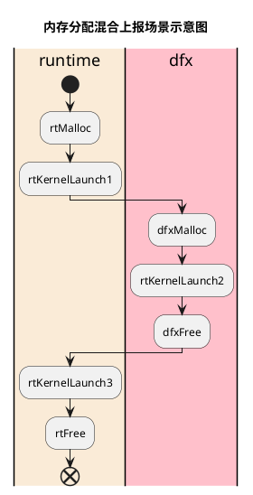

## 检测算法

### 内存检测算法

#### 越界检测增加区间流程图

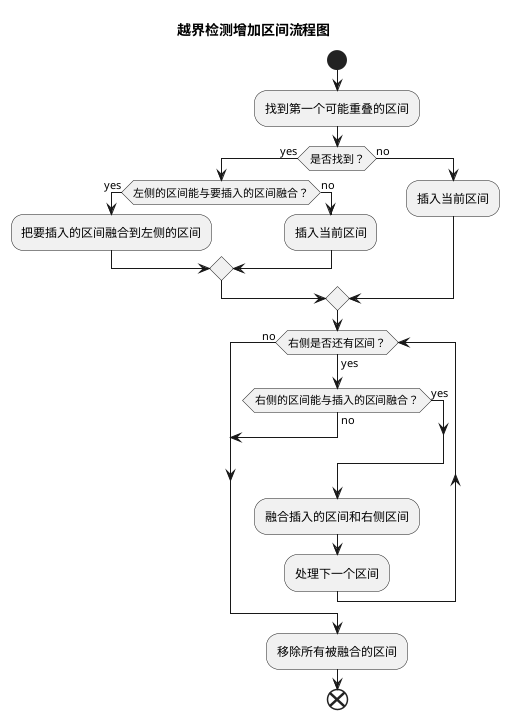

#### 越界检测删除区间流程图

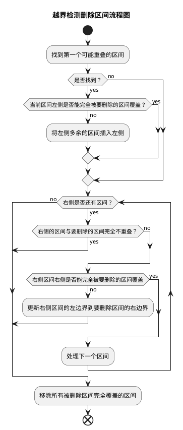

#### 检测区间越界流程图

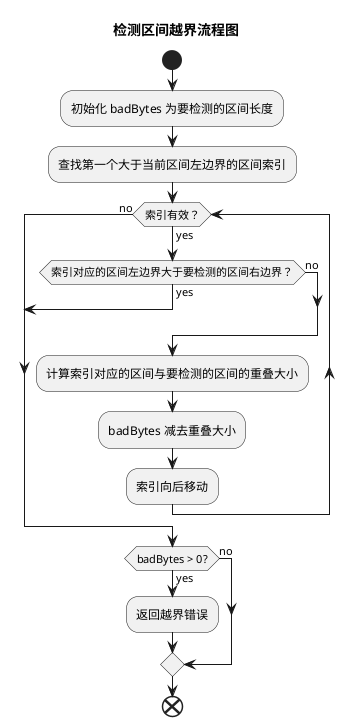

#### BoundsCheck 上下文切换流程图

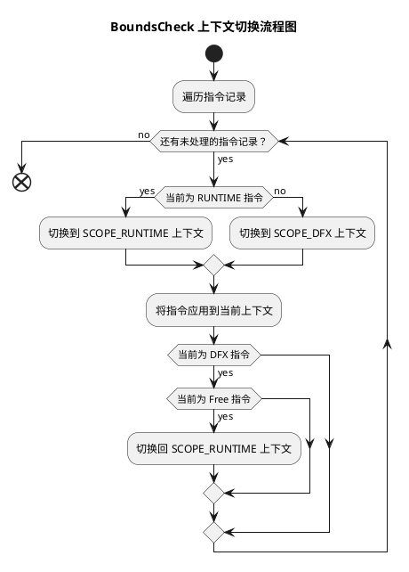

#### IPC 使用示意图

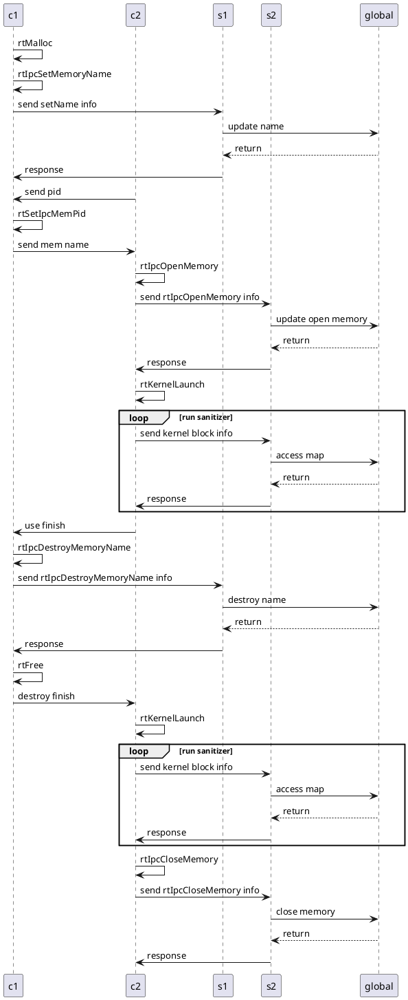

#### rt 接口调用示意图

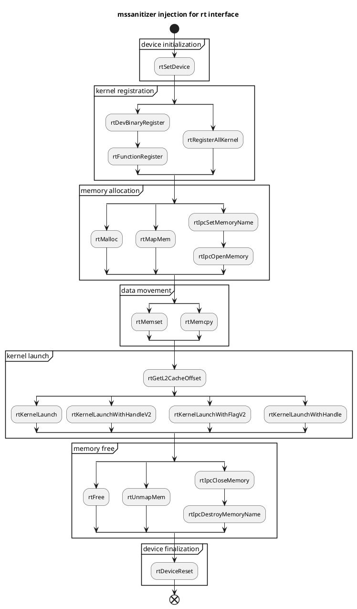

#### aclrt 接口调用示意图

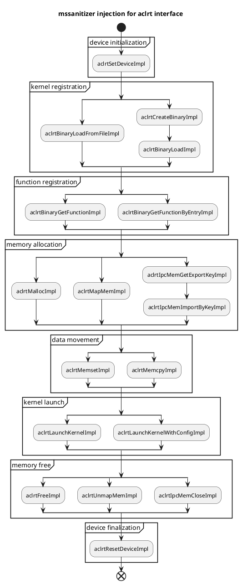

#### 劫持分层管理示意图

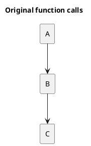

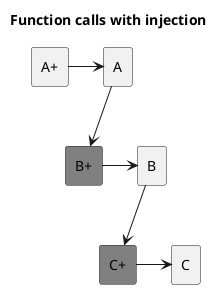

#### 劫持分层管理类图

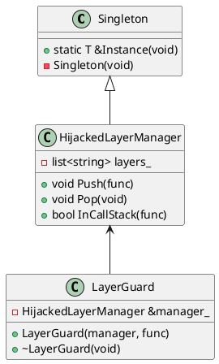

#### aclrt 和 rt 接口模块与周边关系图

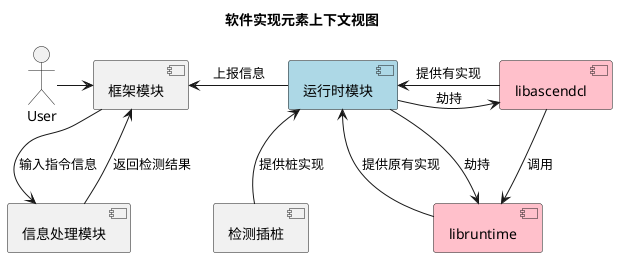

#### aclrt 参数数组生成

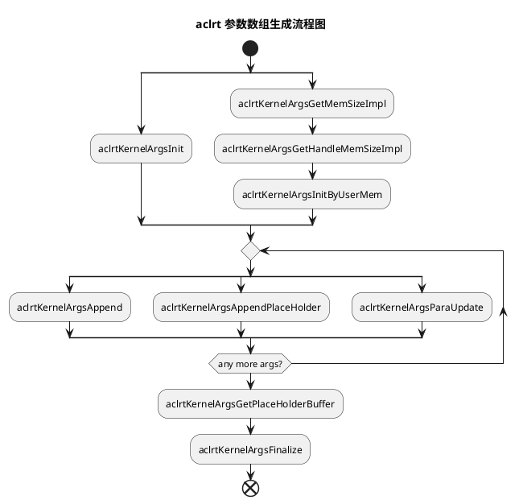

#### ArgsHandleContext 类图

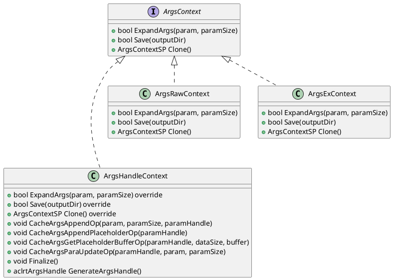

#### 参数重放流程图

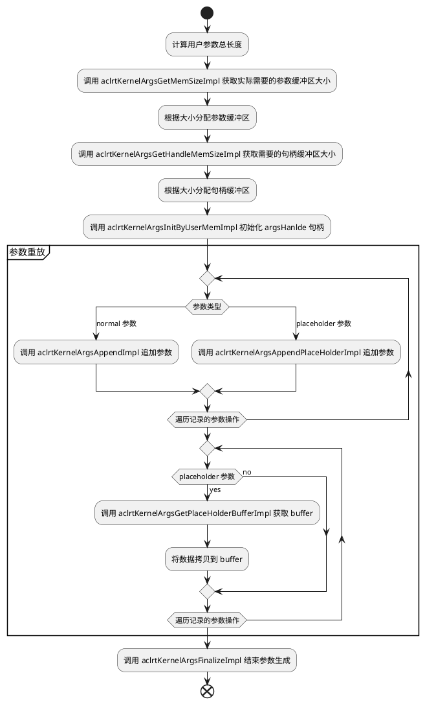