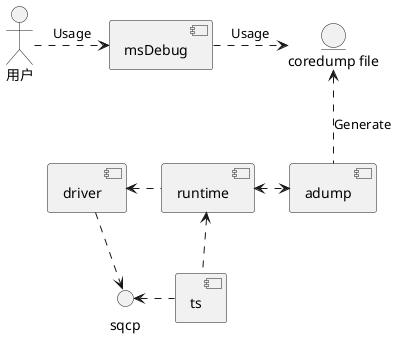
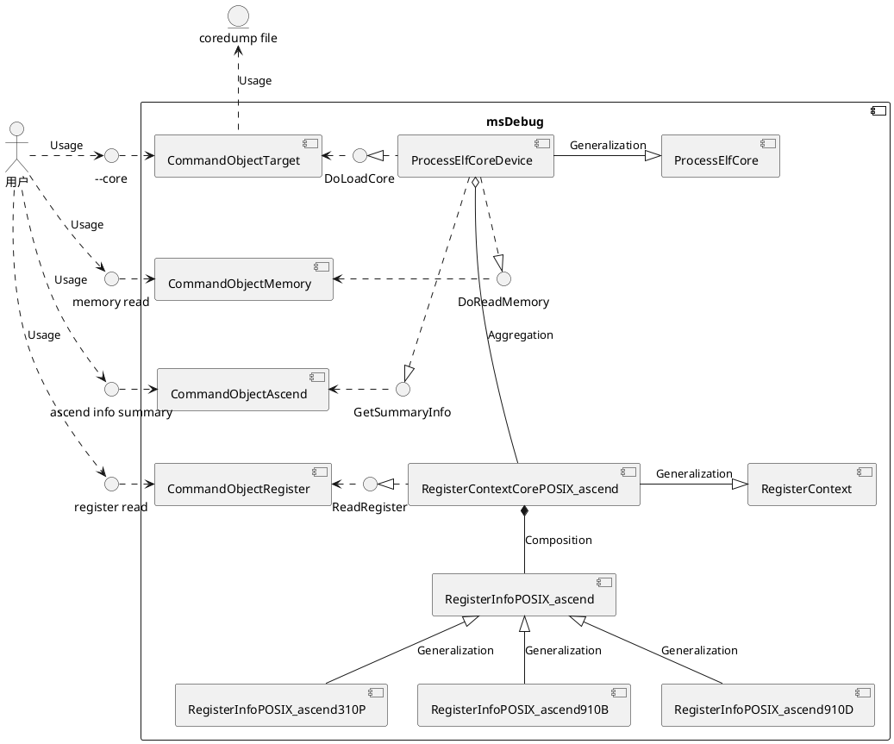
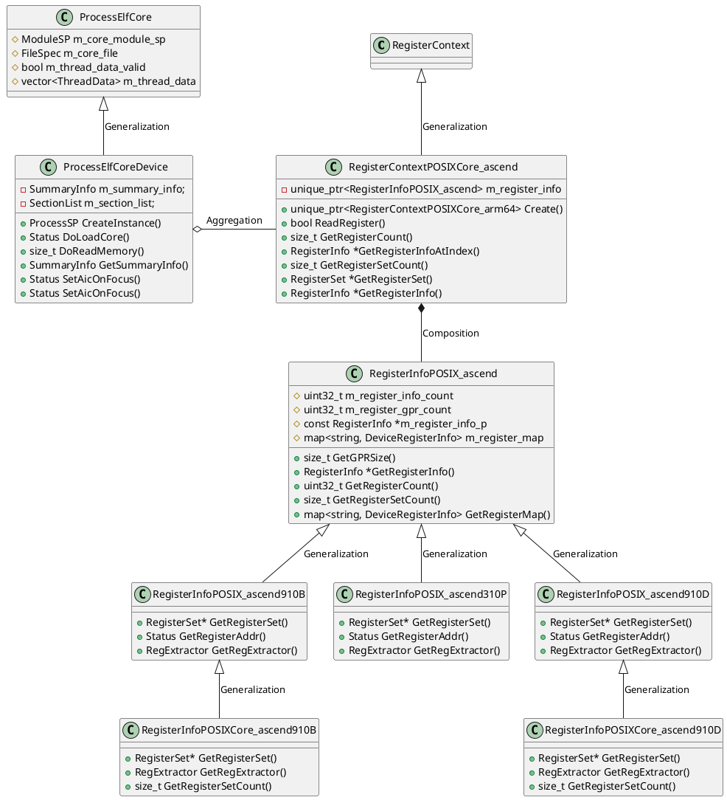
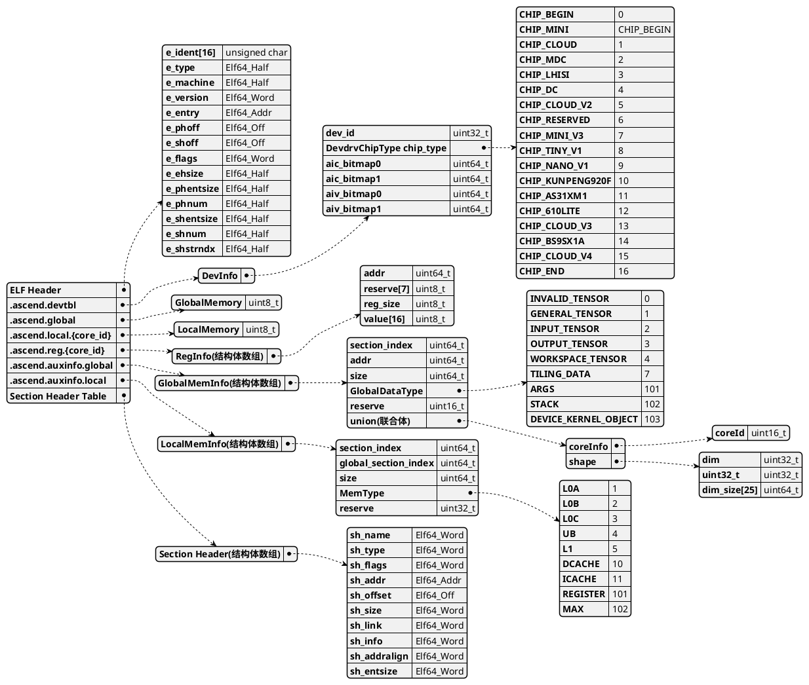

# MindStudio 8.3.0 算子调试组件实现设计说明书

## 1. 概述

算子调试功能本身包含异常检测，功能调试，性能调优三大组件。现有工具中，功能调试工具仅有仿真调试能力。对于功能调试，现有的仿真调试存在仿真与真实结果不一致且性能差的问题。
针对kernel的调试调优主要用户是昇腾算子的开发人员，包括客户算子开发工程师、公司内部算子开发工程师。
本文目的是对算子调试功能进行模块设计，明确主要数据结构和主要处理过程，作为今后的编码阶段的输入和编码人员、测试人员的指导。

## 2. 服务/组件功能清单

| 类型    | 功能清单           | 功能描述                                            | 
| ------- |----------------|-------------------------------------------------|
| 业务功能 | 支持coredump文件分析 | 主要用于加载coredump文件，并提供打印内存、寄存器、coredump汇总信息、切核、查看调用栈的功能 |
| 业务功能 | 支持调试使能 | 在不同算子接入场景下使能调试基础功能 |

## 3.软件实现设计目标分析与关键要素设计

### 3.1 整体设计目标分析

1、代码易扩展：由于不同芯片的寄存器表、内存类型等信息有差异，对于新增芯片类型的寄存器操作维护代码、读内存数据相关代码开发易扩展。易于在不同算子接入场景下扩展调试使能功能。

2、数据一致性：算子调试依赖驱动、rts、编译器提供的数据，需保障数据展示的准确性和一致性，在数据错误时有异常处理机制。

3、支持多种算子调用方式：多算子调用、多进程调用、多线程调用。

4、算子接入方式支持：不同的算子接入方式有差异，需要对runtime接口的劫持适配多种算子调用方式。

5、遵循开源代码：基于lldb原有代码进行修改，参照原有流程补充增加针对昇腾设备的实现。

### 3.2 关键要素设计

| 关键要素 | 设计目标                                                                                              |
| -------- |---------------------------------------------------------------------------------------------------|
| 实现模型 | 基于lldb原有代码进行修改，参照原有流程补充增加针对昇腾设备的实现。由于不同芯片的寄存器表、内存类型等信息有差异，对于新增芯片类型的寄存器操作维护代码、读内存数据相关代码开发易扩展。 |
| 交互模型 | 需要正确处理用户输入的命令行指令和参数，实现相应的调试功能，并回显正常信息或者提示错误信息                                                     |

## 4.开发视图

### 4.1 实现模型

#### 4.1.1 支持coredump文件分析模块

##### 4.1.1.1 概述

本模块主要功能为基于AIC ERR崩溃时产生的coredump文件，使用msDebug工具进行加载文件并分析数据，从而降低用户现场AIC ERR压测诉求，提高硬件异常问题定位效率。

##### 4.1.1.2 上下文视图



支持coredump文件分析功能涉及调试器、驱动、RTS等多个周边组件。本调试模块msDebug属于调试器，部署于CANN架构元素中。
其中驱动、rts基于sqcp调试通道上报的AIC ERR崩溃信息，adump组件产生coredump文件。用户可以使用msDebug加载
coredump文件进行数据分析。

1、coredump文件原始数据的获取同样依赖原有sqcp调试通道，故使用msDebug调试算子程序和产生coredump文件存在冲突，不能同时开启。

2、adump使能coredump文件生成功能需要开关开启。

##### 4.1.1.3 逻辑视图



以表格形式输出软件单元清单：

| 软件单元  | 描述             | 外部接口                               | 内部接口                               | 关系描述                                                                                                |
|-----------------------|----------------|------------------------------------|------------------------------------|-----------------------------------------------------------------------------------------------------|
| CommandObjectTarget   | core文件加载命令解析模块 | --core                             | /                                  | 解析--core命令，获取coredump文件路径，调用DoLoadCore接口执行coredump文件加载命令                                            |
| CommandObjectMemory   | 内存读取命令解析模块     | memory read                        | /                                  | 解析内存读取命令，调用DoReadMemory接口执行各类内存信息打印命令                                                              |
| CommandObjectAscend   | 信息展示、切核命令解析模块  | ascend info summary、ascend aiv/aic | /                                  | 解析ascend命令，调用GetSummaryInfo接口执行获取汇总信息命令，以及调用SetAicOnFocus/SetAivOnFocus接口执行切核命令                     |
| CommandObjectRegister | 寄存器读取命令解析模块    | register read                      | /                                  | 解析寄存器读取命令，调用RegisterContextCorePOSIX_ascend提供的ReadRegister接口执行寄存器信息读取命令                             |
| ProcessElfCoreDevice  | elf core进程模块   | /                                  | LoadCore、ReadMemory、GetSummaryInfo、GetCoresInfo | 继承ProcessElfCore类，提供加载coredump文件接口、内存读取接口、coredump文件信息获取接口、切核接口 、获取核信息                                    |
| RegisterContextCorePOSIX_ascend  | 寄存器管理模块  | /                                  | ReadRegister                       | 在加载coredump时被ProcessElfCoreDevice创建，提供寄存器读取接口给CommandObjectRegister调用，成员变量有RegisterInfoPOSIX_ascend |
| RegisterInfoPOSIX_ascend  | 寄存器信息模块  | /                                  | GetRegisterInfo                    | 作为RegisterContextCorePOSIX_ascend的成员变量，用于存储各种芯片类型的寄存器信息    |

##### 4.1.4 软件实现单元设计

**静态结构图**



通过多态实现寄存器信息类RegisterInfoPOSIX_ascend，方便后续芯片类型的扩展。

#### 4.1.2 支持调试使能

##### 4.1.2.1 概述

msdebug支持启动应用程序进行调试。现在支持多种不同场景下的应用程序调试使能，比如：单算子、PyTorch多算子、MC2算子。为使能调试，msdebug支持获取算子kernel object二进制段调试信息，与运行时算子动态下发信息。
使能调试功能的成功标志是：在正确的时机下发断点并使算子命中断点。

##### 4.1.2.2 上下文视图


AscendC上板调试功能涉及调试器、编译器、驱动、RTS等多个周边组件，本调试模块msdebug属于调试器，部署于CANN架构元素中，配合编译器提供的调试信息，依赖runtime动态库，并使用ts_debug.ko提供的驱动接口向device侧的TSFW下发调试命令，或借助PCIe接口向device侧内存下发断点指令，TSFW接收到调试通知后触发对应的DEBUGGER_API启用调试功能，完成调试后向ts_debug.ko返回处理结果，并返回消息至msdebug，完成一次标准的上板单步调试命令流。通过对DEBUGGER_API的扩展，可分别实现断点设置、恢复运行、单步运行、内存读取、寄存器读取等业务功能，并支持对新功能的扩展。

##### 4.1.2.3 逻辑视图

msdebug内部由以下三个组件组成，组件间通信使用socket实现。


##### 4.1.2.4 软件实现单元设计

lldb模块新增昇腾算子调试信息解析接口，新增并扩展通信接口传输昇腾设备信息；lldb-server模块新增昇腾算子进程抽象类，实现调试使能功能，新增通信server端接口，接收lldb、runtime_stub模块发送的信息；runtime_stub模块实现算子程序运行时接口劫持功能，为使能调试提供运行时信息。


### 4.2 接口

#### 4.2.1 支持coredump文件分析模块

##### 4.2.1.1 总体设计

提供调试器支持coredump文件分析的人机交互接口。外部接口能提供帮助信息，且在输入异常数据时返回失败信息以及修正建议。

##### 4.2.1.2 外部接口清单

1、提供msdebug coredump文件的路径地址，从而加载coredump文件

```
msdebug --core coredump_file [ kernel.o | fatbin格式的可执行文件 ]
```

或

```
msdebug
(msdebug) target create --core coredump_file [ kernel.o | fatbin格式的可执行文件 ]
```

2、用于打印内存地址信息

```
(msdebug) memory read
```

3、用于打印寄存器信息

```
(msdebug) register read
```

4、用于切核查看不同core id的崩溃信息，例如stack数据

```
(msdebug) ascend aiv/aic id
```

5、用于打印coredump文件信息，包含device id、设备类型、core id、tensor信息

```
(msdebug) ascend info summary
```

6、用于展示coredump代码调用栈

```
(msdebug) bt
```

示例：

```
(msdebug) target create --core "AddCustom.core"
Core file 'AddCustom.core' (hiipu64) was loaded.
[Switching to focus on CoreId 36, Type aiv]
(msdebug) ascend info summary
  CoreId  CoreType           PC         DeviceId  ChipType
 *   0       AIV       0x12c04120062c       0        A2/A3
     1       AIV       0x12c04120062c       0        A2/A3
     2       AIV       0x12c04120062c       0        A2/A3

  Id           DataType                   MemType                     Addr                       Size             CoreId    CoreType          dim
   0    DEVICE_KERNEL_OBJECT                GM                   0x12c0c002e000                 182944             NA          NA              NA
   1            STACK                    GM/DCACHE               0x12c100230000                  32768             0          AIV              NA
   2      WORKSPACE_TENSOR                  GM                         0x0                         0               NA          NA              NA
   3         TILING_DATA                 GM/DCACHE               0x12c100240038                   16               NA          NA              NA
   4        OUTPUT_TENSOR                   GM                   0x12c0c0024000                  32768             NA          NA              [8, 2048]
   5        INPUT_TENSOR                    GM                   0x12c0c0012000                  32768             NA          NA              [8, 2048]
   6            ARGS                     GM/DCACHE               0x12c100240000                   96               NA          NA              NA
```

##### 4.2.1.3 内部接口清单

```
接口名：ProcessElfCoreDevice::CreateInstance
接口功能：创建ProcessElfCoreDevice实例
输入参数名：lldb::TargetSP target_sp, lldb::ListenerSP listener_sp, const FileSpec *crash_file, bool can_connect
输出参数名：无
返回值：ProcessSP（ProcessElfCoreDevice实例）
注意事项：需要对elf头中的e_machine字段进行特判，为EM_ASCEND（0x1029）
```

```
接口名：ProcessElfCoreDevice::DoLoadCore
接口功能：加载Coredump文件，ProcessElfCoreDevice中的内部接口，被CommandObjectTarget调用
输入参数名：无
输出参数名：无
返回值：Status（包含运行是否成功以及错误信息）
注意事项：需要实现解析section数据并保存的功能，在解析之前需要对输入文件做安全校验
```

```
接口名：ProcessElfCoreDevice::DoReadMemory
接口功能：ProcessElfCoreDevice中的内部接口，被CommandObjectMemory调用，用于读取内存地址信息
输入参数名：lldb::addr_t addr, size_t size, Status &error, DeviceAddressClass address_class, ArchSpec arch_spec
输出参数名：void *buf
返回值：size_t（返回数据长度信息，若0为读取失败）
注意事项：DeviceAddressClass需要新增支持DCACHE、ICACHE类型，DCACHE又包含GM中的STACK、TILING DATA、ARGS
```

```
接口名：ProcessElfCoreDevice::GetSummaryInfo
接口功能：读取coredump文件相关的汇总信息，被CommandObjectAscend调用
输入参数名：无
输出参数名：无
返回值：SummaryInfo结构体
注意事项：需要新增SummaryInfo结构体定义，用于保存coredumpfile中的辅助信息、内存数据信息，用于展示core id、device id、tensor信息等
```

```
接口名：ProcessElfCoreDevice::ReadRegister
接口功能：读取寄存器信息，RegisterContextCorePOSIX_ascend的接口，被CommandObjectRegister调用
输入参数名：RegisterInfo reg_info（寄存器信息）
输出参数名：RegisterValue value（寄存器数据）
返回值：bool（是否读取成功）
注意事项：需要配合存储寄存器信息表的RegisterInfoPOSIX_ascend和存储寄存器数据的SummaryInfo
```

```
接口名：ProcessElfCoreDevice::UpdateStopInfo
接口功能：更新coredump位置的原因信息。这里主要是展示stop reason信息，通过读取Error寄存器，展示是哪个pipe(cube/ccu/mte/vec/fixp)异常。当ProcessElfCore以及对应Thread线程被创建后要调用，这里只能ObjectCommand来调用；每次SetAixOnFocus(切核的时候)要调用，因为不同核寄存器值不一样。
输入参数名：bool focus_known_error_core , 需要一开始切核切到一个能知道pipe异常的core_id；后续用户手动切就无需设置，默认false
输出参数名：无
返回值：void
```


#### 4.2.2 支持调试使能

##### 4.2.2.1 总体设计

接口设计应满足不同场景下调试使能的功能要求，同时接口易用降低用户上手难度。

##### 4.2.2.2 设计目标

命令行接口按照功能划分，应清晰定义接口提供的功能范围，同时为应对未来可能扩展的场景
预留灵活可扩展的参数。

##### 4.2.2.3 设计约束

接口设计应满足以下场景功能要求：

1. 多算子场景指定算子
2. MC2算子额外需指定device

##### 4.2.2.3 技术选型

对外接口设计如下所示：

指定算子调试使能：

```bash
export LAUNCH_KERNEL_PATH=/path/my_kernel.o
```

指定device调试使能：

方案1：

```bash
(msdebug) ascend device $dev_id
```

方案2：

```bash
export LAUNCH_DEVICE_ID=$dev_id
```

因调试使能后的切核设计为msdebug内部命令：ascend aiv/aic $core_id ，为保持命令设计的统一，采用方案1。

##### 4.2.2.3 软件单元--LLDB子模块

沿用LLDB命令注册框架，新增 `CommandObjectAscendDevice` 类实现 `ascend device $dev_id` 命令功能。

```cpp
class CommandObjectAscendDevice : public CommandObjectParsed {
public:
  explicit CommandObjectAscendDevice(CommandInterpreter &interpreter)
      : CommandObjectParsed(interpreter, "ascend device",
                            "change the id of the focused ascend device.  "
                            "",
                            "ascend device <id>",
                            eCommandRequiresTarget);

  ~CommandObjectAscendDevice() override = default;

protected:
  bool DoExecute(Args &command, CommandReturnObject &result) override;
};
```

### 4.3 数据模型

#### 4.3.1 支持coredump文件分析模块

##### 4.3.1.1 设计目标

1、数据记录的完整性，能完整表达AIC ERR发生时程序运行现场的数据，帮助用户全面定位问题。

2、遵循Linux coredump文件结构定义规则，参考coredump文件，设计适用于昇腾芯片的coredump文件结构。



##### 4.3.1.2 关键字段说明

1.数据类型

| 字段             | 说明   |
|----------------|------|
| Elf64_Addr     | 字节数8 |
| Elf64_Half     | 字节数2 |
| Elf64_Off      | 字节数8 |
| Elf64_Word     | 字节数4 |
| unsigned char  | 字节数1 |

2.ELF Header

| 字段             | 说明                                                                    |
|----------------|-----------------------------------------------------------------------|
| e_ident[EI_NIDENT]     | 最开始处的这 16 个字节含有 ELF 文件的识别标志，并且提供了一些用于解码 和解析文件内容的数据，是不依赖于具体操作系统的。7f 45 4c 46 02 01 01 00 00 00 00 00 00 00 00 00前4位表示ELF，固定的。后面几位具体用途尚未明确，保持和cpu一致。追加了33 07在01后面 |
| e_type     | 此字段表明本目标文件属于哪种类型。ET_CORE, 0x04 |
| e_machine     | 此字段用于指定该文件适用的体系结构，EM_ASCEND=0x1029 |
| e_version     | 此字段指明目标文件的版本。core file版本号，方便后续做兼容, 第一个版本为 0x01 |
| e_entry     | 此字段指明程序入口的虚拟地址。 |
| e_flags     | 此字段含有特定的标志位。标志的名字符合”EF_machine_flag”的格式。对于 Intel 架构来说，它没有定义任何标志位，所以 e_flags 应该为0。 |
| e_ehsize     | 此字段表明 ELF 文件头的大小，以字节为单位。 |
| e_phoff    | 此字段指明程序头表(program header table)开始处在文件中的偏移量，Coredump文件没有程序头表，该值应设为 0 |
| e_shoff      | 此字段指明节头表(section header table)开始处在文件中的偏移量 |
| e_shentsize     | 此字段表明在节头表中每一个表项的大小，以字节为单位   |
| e_shnum  | 此字段表明节头表中总共有多少个表项    |
| e_shstrndx  | 节头表中与节名字表相对应的表项的索引    |
| e_shnum  | 此字段表明节头表中总共有多少个表项    |

3.Section Header

| 字段           | 说明                                               |
|--------------|--------------------------------------------------|
| sh_name      | 本节的名字，是一个索引号，指向“字符串表”节中的某个位置，那里存储了一个以’\0’结尾的字符串  |
| sh_offset    | 指明了本节所在的位置，该值是节的第一个字节在文件中的位置，即相对于文件开头的偏移量，单位是字节  |
| sh_size      | 指明节的大小，单位是字节                                     |
| sh_addralign | 此成员指明本节内容如何对齐字节，即该节的地址应该向多少个字节对齐 , 16字节对齐     |
| sh_entsize   | .ascend.regs有值sizeof(RegInfo)=16，其他段为0           |
| sh_link      | .auxinfo.global section在section header table中的索引 |
| sh_info      | GlobalMemInfo结构体数组中的索引                           |

4.sh_name

| 字段             | 说明                            |
|----------------|-------------------------------|
| .ascend.global   | 存放各种连续的gm单段内存                 |
| .ascend.local.{core_id}   | 存放各个core内不同内存类型的连续内存          |
| .ascend.regs.{core_id}    | 存放各个core的所有寄存器数据              |
| .ascend.devtbl  | 存放全局设备信息数据                    |
| .ascend.auxinfo.global | 存放对global memory section的描述信息 |
| .ascend.auxinfo.local | 存放各个local memory section的描述信息 |
| .ascend.host_kernel_object | 存放host上缓存的kernel object数据 |
| .ascend.file_kernel_object | 存放kernel object文件数据 |
| .ascend.file_kernel_json | 存放kernel json文件数据 |

5.".ascend.devtbl"

| 字段             | 说明                                              |
|----------------|-------------------------------------------------|
| DevdrvChipType chip_type | 设备类型，当前支持CHIP_CLOUD_V2和CHIP_CLOUD_V4 |
| uint64_t aic_bitmap0  | 当前kernel用了哪些ai core，bit位置1表示用了 |
| uint64_t aic_bitmap1   |  |
| uint64_t aiv_bitmap0 |  |
| uint64_t aiv_bitmap1 |  |
| uint32_t dev_id | 使用的设备|

```
enum DevdrvChipType : uint32_t {
    CHIP_BEGIN = 0,
    CHIP_MINI = CHIP_BEGIN,
    CHIP_CLOUD,
    CHIP_MDC,
    CHIP_LHISI,
    CHIP_DC,
    CHIP_CLOUD_V2 = 5,  // 910B/C
    CHIP_RESERVED = 6,
    CHIP_MINI_V3 = 7,
    CHIP_TINY_V1 = 8,
    CHIP_NANO_V1 = 9,
    CHIP_KUNPENG920F = 10,
    CHIP_AS31XM1 = 11,
    CHIP_610LITE = 12,
    CHIP_CLOUD_V3 = 13,
    CHIP_CLOUD_V4 = 14,
    CHIP_END
};
```

6.".ascend.reg.{core_id}"

| 字段         | 说明             |
|------------|----------------|
| addr       | 寄存器地址          |
| reserve[7] | 预留字段           |
| reg_size   | 寄存器大小，单位字节     |
| value[16]  | 寄存器值，考虑128位的情况， A5是32字节 |

7.".ascend.auxinfo.global"

```
此section为GlobalMemInfo 结构体数组

struct GlobalMemInfo {
    uint64_t addr; // 虚拟地址
    uint64_t size;  // 内存大小
    uint32_t section_index; // 对应哪个.ascend.global section
    GlobalDataType type; // 内存是input/output/workspace/stack等类型
    uint16_t reserve;
    union {
        struct {
            uint16_t coreId;
        } coreInfo;                // stack 类型的内存区分不同core
        struct {
            uint32_t dim; // tensor shape
            uint32_t reserve;
            uint64_t dim_size[25];
        } shape;                    // input、output
    };
};

```


8.GlobalDataType

| 字段        | 说明               |
|-----------|------------------|
|  INVALID_TENSOR | 无效向量             |
| GENERAL_TENSOR | 通用向量             |
| INPUT_TENSOR | 输入向量             |
| OUTPUT_TENSOR | 输出向量             |
| WORKSPACE_TENSOR | workspace向量      |
| TILING_DATA | tiling数据         |
| ARGS | 参数               |
| DEVICE_KERNEL_OBJECT | device侧GM中算子.o数据 |

8.".ascend.auxinfo.local"

| 字段        | 说明                                                                  |
|-----------|---------------------------------------------------------------------|
| section_index | 对应哪个.ascend.local section                                           |
| global_section_index | 对应哪个.ascend.global section，只有dcache有效，dcache分args、tiling data、stack |
| size | 内存大小                                                                |
| rtDebugMemoryType | local memory内存类型               |

#### 4.3.2 支持调试使能

不涉及数据模型设计。

### 4.5 安全实现设计

#### 4.5.1 安全设计目标

> 新增外部输入文件，需要做好如下安全防护：可读性和可执行、文件大小、文件存在性、文件路径长度、非软链接、roup和other用户组不可写，属主为root或当前用户

#### 4.5.2 高风险模块识别

##### 4.5.3.1 高风险API识别

| 高风险API | 接口说明                | 高风险接口函数分析          | 对应代码目录              | 语言类型 | 备注 |
|--------|---------------------|--------------------| ------------------------- |------| ---- |
| --core | 输入coredump文件并读取其中数据 | 考虑外部输入文件校验操作、软链接攻击 | CommandObjectTarget.cpp | C++  |      |

#### 4.5.3 代码实现安全防范处理

**1. 高风险API安全加固**

对于外部文件输入，进行充分的权属校验：
文件存在性校验，文件读写等使用权限校验，文件数量和大小校验
软链接校验：禁止使用软链接或存在软链接的风险与异常场景进行防护
权属校验：(针对读取命令或者启动脚本场景) 一般需要保证当前输入文件只能由当前进程用户(ruid)所有或root所有，且其他用户权限不包含写权限，此时目标文件才是可信的
针对特定业务场景，可以根据实际业务逻辑进行额外的校验，进一步确保输入文件可信。

**2. 错误和异常处理**
合理的错误和异常处理机制能够保证API能在异常情况下也能以可控的方式终止，并向用户返回恰当的错误信息。
在校验完成后发现错误，提示报错信息，并给出合理的修改建议。
如coredump文件发现能被其他user或者group写时，给出报错：

> error: Risky action, "coredump file" is writable by any other users or groups.

#### 4.5.4 代码实现安全防范处理

1.入参校验： 会对工具输入每一个命令和入参进行校验，且后续新增任意输入项都需要补充校验逻辑。

2.错误处理： 如果会校验输入文件的路径、权限、是否为软链接、是否包含非法字符、是否可写、属组、属主是否正确。若校验失败则进程退出，不进行后续操作。

3.日志审计： 当前日志中禁止打印文件路径，不可在功能正常的情况下打印ERROR等级信息，在一些循环逻辑中需要注意日志打印，不可造成刷屏。

### 4.6 开发者测试模型

#### 4.6.1 支持coredump文件分析模块

本文档用于定义msDebug（支持coredump文件分析需求）的开发者测试关键要素模型，作为0层的DT公共设计，包括软件可测试性设计和测试分层策略，其中针对不同的分层，进行DT环境、测试工程设计、基础通用
框架和领域专用框架设计、DFX专项测试等。

##### 4.6.1.1 设计约束

架构设计的原则和约束限制。

##### 4.6.1.2 可测试性设计

UT：覆盖全部接口，行覆盖率达80%，分支覆盖率达60%。

IT：将软件的各单元（功能模块）按照概要设计说明书针对模块、子系统、系统的组装测试。

ST：测试各个完整的功能是否正确。

##### 4.6.1.3 分层测试

| 分层 | 测试类型      | 测试对象                                    | 测试价值 |
|---|-----|-----------------------------------------| ---|
| UT    |    单元测试    | 全部接口内部函数、类        | 验证最小实现单元工作是否符合预期
| IT    | 集成测试 | 支持coredump文件分析模块       | 验证使用msDebug加载、分析coredump文件功能是否正常
| ST     |   系统测试 | 算子崩溃、产生coredump文件、使用msDebug分析coredump文件 | 端到端看护本模块全流程功能是否正常

##### 4.6.1.4 关键测试技术方案

1、测试工程设计

UT：使用gtest，打桩使用gmock

2、物理设计

ST目录结构：

```
lldb
├── test
│    ├── API
│    └── Shell
│        └── Commands
│            └── AscendCommandScriptImmediateOutput
│                └── Coredump
└────── Unit
```

UT目录结构：

```
lldb
└── unittests
     └── Process
         ├── elf-core
         │    ├── ProcessElfCoreDeviceTest.cpp
         │    └──RegisterContextPOSIXCore_ascendTest.cpp
         └──Utility
              └── RegisterInfoPOSIX_ascendTest.cpp
```

3、运行环境

由于当前支持的机器类型有A2、A3，所有ST需要在这两类机器上运行。

#### 4.6.2 调试使能

##### 4.6.2.1 设计目标

新增外部输入文件，需要做好如下安全防护：可读性/可执行，文件大小，文件存在性，文件路径长度，非软链接，group和other用户组不可写，属主为root或当前用户

##### 4.6.2.2 设计约束

遵从架构设计约束。

##### 4.6.2.3 可设计性设计

LLVM框架提供了llvm-lit工具支持对命令行交互命令进行便捷验证，沿用该工具完成msdebug工具的ST测试。
测试用例设计如下：

|  测试场景                                                                       |  测试方案                                                                                          |  预期结果                |
| --------------------------------------------------------------------------------- | ---------------------------------------------------------------------------------------------------- | -------------------------- |
|  c++直接<<<>>>启动算子，算子打包在fatbin中                                      |  使用c++工程编译出二进制文件，进行断点、变量打印调试                                               |  断点、变量功能打印正常  |
|  python PyTorch框架启动aclnn封装的算子，算子文件独立存放                        |  使用python PyTorch启动aclnn算子，手动导入算子调试信息，进行断点、变量打印调试                     |  断点、变量功能打印正常  |
|  python PyTorch框架启动<<<>>>封装的算子，算子打包在动态库中                     |  使用python PyTorch启动<<<>>>算子，进行断点、变量打印调试                                          |  断点、变量功能打印正常  |
|  python PyTorch框架启动aclnn封装的算子，算子打包在动态库中                      |  使用python PyTorch启动aclnn算子，进行断点、变量打印调试                                           |  断点、变量功能打印正常  |
|  调试器打开驱动失败                                                             |  移除驱动设备节点后，使用c++工程编译出二进制文件，进行断点、变量打印调试                           |  运行后抛出异常终止调试  |
|  runtime库接口函数指针获取失败                                                  |  移动runtime库文件位置后，使用c++工程编译出二进制文件，进行断点、变量打印调试                      |  运行后抛出异常终止调试  |
|  驱动初始化调试使能模式失败                                                     |  使用较老的驱动包后，使用c++工程编译出二进制文件，进行断点、变量打印调试                           |  运行后抛出异常终止调试  |
|  算子运行时信息获取失败                                                         |  使用c++工程编译出二进制文件，进行断点、变量打印调试，打桩pcStartAddr获取函数，构造失败            |  运行后抛出异常终止调试  |
|  使用已被占用的device进行调试                                                   |  使用c++工程编译出二进制文件，进行断点、变量打印调试，不退出，再次启动，进行断点、变量打印调试     |  运行后抛出异常终止调试  |
|  依赖的CANN环境变量未找到                                                       |  手动清空环境变量\$ASCEND\_TOOLKIT\_HOME的值，使用c++工程编译出二进制文件，进行断点、变量打印调试  |  运行后抛出异常终止调试  |
|  python PyTorch框架启动多个aclnn封装的算子，算子文件独立存放，指定特定算子调试  |  使用python PyTorch启动aclnn算子，手动导入算子调试信息，进行断点、变量打印调试                     |  断点、变量功能打印正常  |
|  python PyTorch框架启动aclnn封装的算子，算子打包在动态库中，指定特定算子调试    |  使用python PyTorch启动aclnn算子，手动导入算子调试信息，进行断点、变量打印调试                     |  断点、变量功能打印正常  |

##### 4.6.2.4 分层测试

| 分层| 测试类型 | 测试对象 | 测试价值 |
| ST | 冒烟测试 | msdebug | 验证工具端到端功能 |
| UT | 单元测试 | AscendProcessLinux | 验证Ascend进程抽象类功能正确 |

##### 4.6.2.5 关键测试技术方案

1. 测试工程技术
   LLVM项目中使用llvm-lit测试框架进行冒烟测试，端到端验证测试LLDB功能，可继续沿用此框架看护msdebug功能。
2. 物理设计
   独立于业务代码目录，测试用例存放于test目录中，按照不同算子调用场景分开存放。
   
   ```bash
   $ tree ./test/Shell/Commands/AscendCommandScriptImmediateOutput
   ./test/Shell/Commands/AscendCommandScriptImmediateOutput
   ├── AddAclnn
   │   ├── command-ascend-breakpoint.test
   │   ├── command-ascend-info.test
   │   ├── command-ascend-readmemory.test
   │   └── command-ascend-readregister.test
   ├── AddKernelInvocation
   │   ├── command-ascend-breakpoint.test
   │   ├── command-ascend-info.test
   │   ├── command-ascend-readmemory.test
   │   └── command-ascend-readregister.test
   ├── AddKernelInvocationNeo
   │   ├── command-ascend-breakpoint.test
   │   ├── command-ascend-info.test
   │   ├── command-ascend-readmemory.test
   │   └── command-ascend-readregister.test
   ├── br_test_suites_gen.py
   ├── Coredump
   │   ├── command-coredump-add.test
   │   └── command-coredump-gather.test
   ├── MatmulAclnn
   │   ├── command-ascend-breakpoint.test
   │   ├── command-ascend-info.test
   │   ├── command-ascend-readmemory.test
   │   └── command-ascend-readregister.test
   ├── MatMulInvocationNeo
   │   ├── command-ascend-breakpoint.test
   │   ├── command-ascend-info.test
   │   ├── command-ascend-readmemory.test
   │   └── command-ascend-readregister.test
   ├── MatMulLeakyReluAclnn
   │   ├── command-ascend-breakpoint.test
   │   ├── command-ascend-info.test
   │   ├── command-ascend-readmemory.test
   │   └── command-ascend-readregister.test
   ├── MatMulLeakyReluInvocation
   │   ├── command-ascend-breakpoint.test
   │   ├── command-ascend-info.test
   │   ├── command-ascend-readmemory.test
   │   └── command-ascend-readregister.test
   └── op_precision_test
       ├── prepare_env.sh
       ├── run_test_cases.sh
       ├── test_case_add_framework_aclnn.sh
       ├── test_case_add_kernel_invocation_neo.sh
       ├── test_case_add_kernel_invocation.sh
       ├── test_case_flash_attention_score_singe_tiling.sh
       ├── test_case_matmul_framework_aclnn.sh
       ├── test_case_matmul_kernel_invocation_neo.sh
       ├── test_case_matmul_kernel_invocation.sh
       ├── test_case_matmul_leakyrelu_framework_aclnn.sh
       └── test_case_matmul_leakyrelu_kernel_invocation.sh
   ```
3. 运行环境
   运行环境依赖昇腾硬件。
4. 测试替身设计
   暂无。
5. DSL设计
   暂无。
6. 数据构造设计
   使用真实的数据来实现组件或者端到端的验收测试。
7. 夹具设计
   暂无。
8. 匹配器设计
   暂无。

## 5. 运行视图

### 5.1 交互模型

#### 5.1.1 支持coredump文件分析

```plantuml
hide footbox
actor "Actor1" as actor1

activate actor1

participant "Command" as command
participant "ProcessElfCoreDevice" as process
participant "RegisterContextPOSIXCore_ascend" as register
actor1-> command: msdebug --core coredump_file
activate command

command->process:创建ProcessElfCoreDevice实例
activate process
process-->command
deactivate process

command->process:DoLoadCore
activate process
process->process:解析coredump file

process->register:创建RegisterContextPOSIXCore_ascend实例
activate register
register-->process
deactivate register

process->process:保存数据，恢复现场

process-->command

deactivate process

command-->actor1
deactivate command

group 展示汇总信息
    actor1->command:ascend info summary
    activate command
    command->process:GetSummaryInfo
    activate process
    process->process:从coredump_file的解析数据里读取
    process-->command
    deactivate register
    command-->actor1
    deactivate command
end

group 读内存
    actor1->command:read memory
    activate command
    command->process:DoReadMemory
    activate process
    process->process:从coredump_file的解析数据里读取
    process-->command
    deactivate process
    command-->actor1
    deactivate command
end

group 读寄存器
    actor1->command:register read
    activate command
    command->register:ReadRegister
    activate register
    register->register:从coredump_file的解析数据里读取
    register-->command
    deactivate register
    command-->actor1
    deactivate command
end

group 切核
    actor1->command:ascend aiv/aic
    activate command
    command->process:SetAicOnFocus/SetAivOnFocus
    activate process
    process->process:切换聚焦核
    process->command
    deactivate process
    command->actor1
    deactivate command
end


@enduml
```

基于用户输入的指令传入不同的Command命令解析类中，并通过进程管理类和寄存器管理类执行命令，获取coredump文件数据。

#### 5.1.2 支持调试使能

指定算子调试使能交互流程如下所示，获取算子kernel object二进制段与运行时信息，并在算子kernel被执行之前使能调试功能。
支持指定特定的算子进行调试，需定义如下的概念：

1) 算子kernel的独有标识；
2) 确定使能的算子kernel；
3) 使能特定算子kernel调试的时机；

首先，使用加密算法（比如SHA256）对算子kernel object文件进行哈希计算，获取一个独有的哈希值来标识该算子kernel。不使用算子kernel文件的文件系统路径作为标识的原因在于，无法保证不与其他算子kernel object同名。

其次，确定使能哪一个算子kernel的方法是，当用户设置的断点位置匹配到算子kernel object中的调试信息时，我们认为用户期望使能该kernel。当累计有多个断点匹配到了不同的算子kernel时，取最后设置的断点对应的kernel作为期望使能的算子kernel，如此，理论上用户完成一个算子kernel调试后，再次设置下一个算子kernel的断点，可继续完成调试。

最后，使能特定算子kernel调试的时机关键在于完成device断点设置的时机。调试器需要劫持rtKernelLaunch()等系列接口，在每个算子kernel调用该函数前，告知调试器本次调用的算子kernel的标识，若标识与用户指定的算子kernel匹配，那么调试器即按照该算子kernel的运行时信息配置device断点，完成配置后通知算子kernel继续运行，直到命中断点。


指定device调试使能交互流程如下所示：


